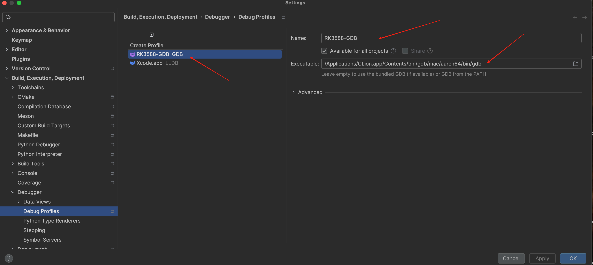
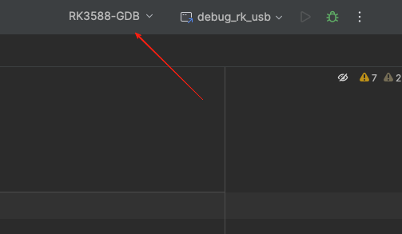
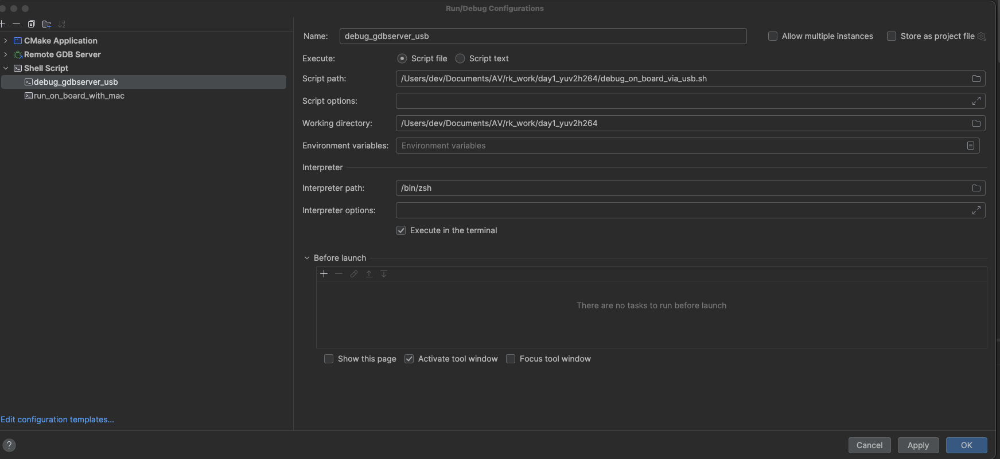
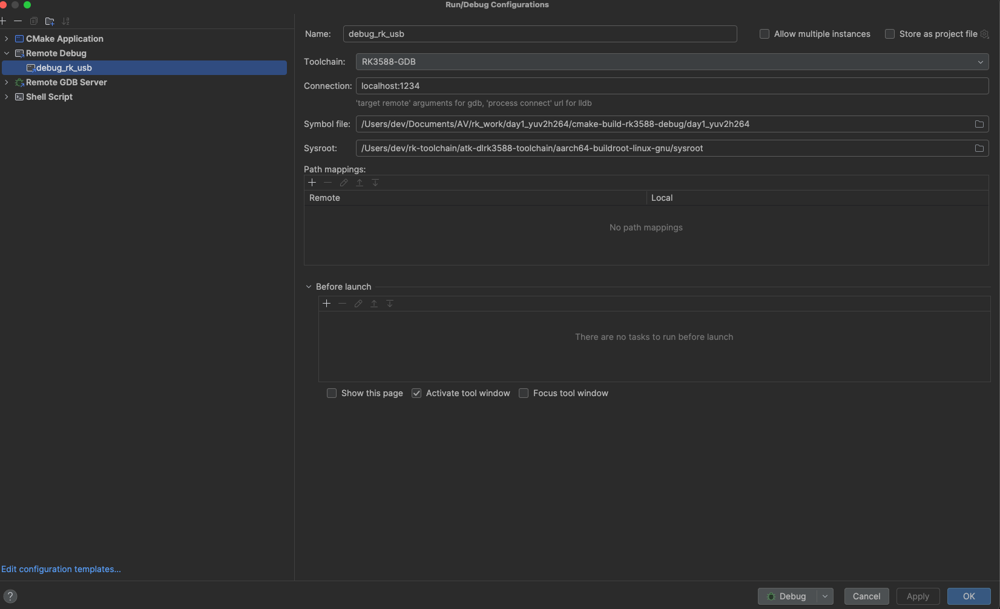
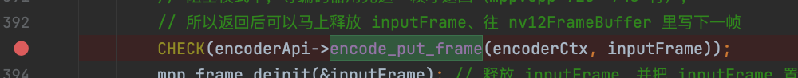
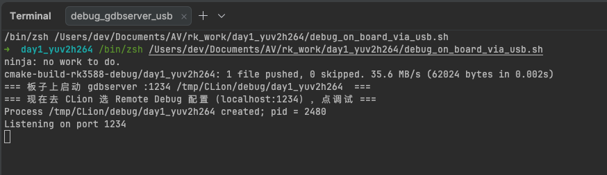
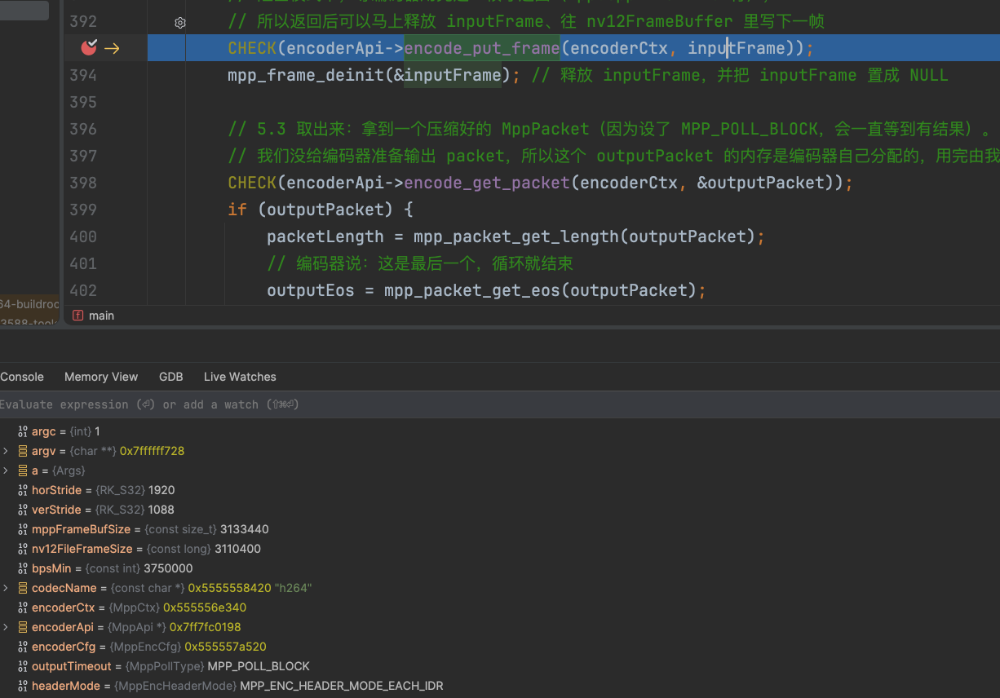

# 用 USB 连接并调试板子

> 目标：在 CLion 里给 `main.cpp` 打断点，程序在 RK3588 板子上跑，停在断点上看变量。**全程走 USB，不需要板子 IP，不走网络。**
> 相关文件：`debug_on_board_via_usb.sh`（本文的脚本）、`run_on_board_with_mac.sh`（只运行、不调试）

---

## 1. 原理

```
 Mac（CLion）                                           RK3588 板子
┌──────────────────────┐                             ┌─────────────────────────────────┐
│ GDB（CLion 自带）      │                             │ gdbserver :1234                 │
│ target remote          │  localhost:1234   adb       │   └─ 启动并控制 day1_yuv2h264   │
│   localhost:1234  ─────┼──→ adb forward ──USB 线──→──┼─→ 板子的 1234 端口              │
│                        │                             │                                 │
│ 断点 / 单步 / 看变量    │ ←──── 调试命令和结果 ────── │ 程序的输出打印在 gdbserver 窗口  │
└──────────────────────┘                             └─────────────────────────────────┘
```

- **gdbserver**：跑在板子上的"调试代理"，负责启动程序、在断点处停下、把寄存器和内存读给 GDB。板子上自带：`/usr/bin/gdbserver`。
- **GDB**：跑在 Mac 上，CLion 自带一个支持 aarch64 的（`/Applications/CLion.app/Contents/bin/gdb/mac/aarch64/bin/gdb`，版本 17.1），负责显示源码、断点、变量。
- **`adb forward tcp:1234 tcp:1234`**：把 Mac 本机的 1234 端口，通过 USB 线转发到板子的 1234 端口。GDB 以为自己连的是本机，其实连到了板子上。

和"走网络（SSH）"的方式对比：

| | 走 USB（本文） | 走网络（SSH，原来的 `debug_rk`） |
|---|---|---|
| 需要板子 IP | ❌ 不需要 | ✅ 需要，IP 变了就要改配置（之前从 .196 变成 .197，CLion 就卡在 "Starting run configuration"） |
| 需要板子联网 | ❌ | ✅ |
| 连线 | OTG 线（TypeC0 口） | 网线 / Wi-Fi |
| 程序输出 | 显示在 gdbserver 脚本窗口 | 显示在 CLion 调试窗口 |
| 启动步骤 | 两步：先运行脚本，再点调试 | 一步 |

---

## 2. 前提条件（检查一遍）

| 检查项 | 怎么检查 | 不满足怎么办 |
|---|---|---|
| 板子通过 USB 连上了 | `adb devices` 能看到一个 `device` | 检查 OTG 线是不是插在 TypeC0 口 |
| 板子上有 gdbserver | `adb shell ls -l /usr/bin/gdbserver` | 出厂系统自带；没有的话要从 SDK 里拷一个 aarch64 版的上去 |
| CLion 的 CMake profile 是交叉编译 | `RK3588-Debug` 的 CMake options 里有 `-DCMAKE_TOOLCHAIN_FILE=/Users/dev/rk-toolchain/rk3588-toolchain.cmake` | 见 `guide/01_环境准备.md` 第 2 节 |
| 编出来的程序带调试信息 | `file cmake-build-rk3588-debug/day1_yuv2h264` 输出里有 `with debug_info` | 确认 profile 是 **Debug** 构建类型（编译命令里会带 `-g`），Release 构建打不了断点 |
| 程序能找到新的 MPP 库 | `CMakeLists.txt` 里有 `-Wl,-rpath,/userdata/mpp_build/lib` | 没有 rpath 的话，gdbserver 启动的程序会加载出厂的旧库，报 `undefined symbol: mpp_buffer_sync_begin_f` |
| 测试素材在板子上 | `adb shell ls -l /userdata/av/in_1080p_60f.nv12` | 运行 `./run_move_file_to_board_via_usb.sh` |

---

## 3. 脚本 `debug_on_board_via_usb.sh` 做了什么

```
① 编译           cmake --build cmake-build-rk3588-debug --target day1_yuv2h264
② 检查板子        adb get-state
③ 推程序          adb push → /tmp/CLion/debug/day1_yuv2h264（顺手 pkill 上次没退出的 gdbserver）
④ 端口转发        adb forward tcp:1234 tcp:1234
⑤ 启动 gdbserver  adb shell gdbserver :1234 /tmp/CLion/debug/day1_yuv2h264 [程序参数]
                  → 程序停在第一条指令，等 GDB 连上来；脚本会一直停在这一步
```

- 程序参数原样传给 `day1_yuv2h264`：`./debug_on_board_via_usb.sh -t h265 -o /userdata/av/out.h265`
- 换端口：`GDB_PORT=2345 ./debug_on_board_via_usb.sh`（CLion 里的 `localhost:1234` 也要跟着改）
- 调试用的程序放在 `/tmp/CLion/debug/`，和运行脚本用的 `/tmp/CLion/run/` 分开，互不影响

---

## 4. CLion 配置（只需要做一次）

一共要配 3 样东西，截图都是实际配好的样子（CLion 2026.2，截图在 `img/debug_by_usb/`）：

| # | 配什么 | 在哪里 | 作用 |
|:---:|---|---|---|
| 4.1 | Debug Profile `RK3588-GDB` | Settings → Debugger → Debug Profiles，再在**主工具栏**选中它 | 让 CLion 用 GDB 调试（默认是 Xcode 的 LLDB） |
| 4.2 | Shell Script `debug_gdbserver_usb` | Run → Edit Configurations | 运行脚本：推程序、端口转发、启动 gdbserver |
| 4.3 | Remote Debug `debug_rk_usb` | Run → Edit Configurations | GDB 连到 `localhost:1234`，打断点调试 |

### 4.1 Debug Profile `RK3588-GDB`：让 CLion 用 GDB

**为什么要配**：CLion 默认用 Xcode 的 **LLDB** 调试，而调试板子上的 aarch64 Linux 程序要用 **GDB**。
CLion 2026.2 里，**用哪个调试器由 Debug Profile 决定，并且在主工具栏上切换**。

> ⚠️ 踩过的坑：一开始是在 **Settings → Toolchains** 里新建了一个工具链，把 Debugger 设成 GDB（截图 `img/debug_by_usb/Toolchain_RK3588-GDB.png`），界面上显示 `Version: 17.1`，但**实际调试时用的还是 LLDB**，报错 `unsupported connection URL: ''`。页面上那行黄字 "The toolchain Debugger is deprecated. Use Debug Profiles instead." 说的就是这个：工具链里的 Debugger 设置已经不起作用了。

**① 新建 GDB profile**
**Settings（`Cmd + ,`）→ Build, Execution, Deployment → Debugger → Debug Profiles** → 点 `+` → 选 **GDB**



| 字段 | 填什么 |
|---|---|
| Name | `RK3588-GDB` |
| Executable（GDB 可执行文件） | `/Applications/CLion.app/Contents/bin/gdb/mac/aarch64/bin/gdb`（CLion 自带的 GDB 17.1，支持 aarch64） |
| Available for all projects | 可选；勾上后其他项目也能用 |

列表里另一个 `Xcode.app (LLDB)` 是 CLion 原来默认的，**不要删**，Mac 上调试本机程序还要用它。

**② 在主工具栏选中这个 profile**
CLion 顶部，运行配置下拉框（`debug_rk_usb`）的**左边**，就是 Debug Profile 的下拉框，切换成 **`RK3588-GDB`**：



> 这个选择是全局的：之后调试 Mac 本机的程序，要记得切回 `Xcode.app`。

**（工具链 `RK3588-GDB`）**：在 Settings → Toolchains 里建的那个工具链可以保留，`debug_rk_usb` 的 Toolchain 字段选的就是它，实测这样能正常调试。真正决定用 GDB 还是 LLDB 的，是这里的 Debug Profile。

### 4.2 Shell Script `debug_gdbserver_usb`：启动 gdbserver

**Run → Edit Configurations… → 左上角 `+` → Shell Script**



| 字段 | 填什么 |
|---|---|
| Name | `debug_gdbserver_usb` |
| Execute | Script file |
| Script path | `/Users/dev/Documents/AV/rk_work/day1_yuv2h264/debug_on_board_via_usb.sh` |
| Script options | 程序参数，可以留空；例如 `-t h265 -o /userdata/av/out.h265` |
| Working directory | `/Users/dev/Documents/AV/rk_work/day1_yuv2h264` |
| Interpreter path | `/bin/zsh`（截图里的）或 `/bin/sh` 都可以 |
| Execute in the terminal | **勾上**（程序输出显示在终端窗口里） |
| Before launch | 留空（脚本自己会先编译） |

> Interpreter 用 `/bin/zsh` 时有一个小坑：如果设置了环境变量 `ADB_SERIAL`（同时连着好几台 adb 设备），zsh 不会把 `$ADB` 里的 `adb -s 序列号` 拆开，adb 会报错。只连一块板子、不设 `ADB_SERIAL` 时没有影响；要用 `ADB_SERIAL` 的话，把 Interpreter 改成 `/bin/sh`。`run_on_board_with_mac` 配置也是同样的情况。

### 4.3 Remote Debug `debug_rk_usb`：用 GDB 连上去调试

**Run → Edit Configurations… → 左上角 `+` → Remote Debug**



| 字段 | 填什么 | 说明 |
|---|---|---|
| Name | `debug_rk_usb` | |
| Toolchain | `RK3588-GDB` | 选 Settings → Toolchains 里建的那个工具链（实测能用）。决定用 GDB 的是 4.1 的 Debug Profile，不是这里 |
| **Connection** | **`localhost:1234`** | 用 GDB 时这里填的就是 `target remote` 的参数（输入框下面的提示："'target remote' arguments for gdb"）。**不是板子 IP**，连的是本机，adb 会转发到板子 |
| Symbol file | `/Users/dev/Documents/AV/rk_work/day1_yuv2h264/cmake-build-rk3588-debug/day1_yuv2h264` | Mac 上那份带调试信息的程序，GDB 从它读源码行号和变量名 |
| Sysroot | `/Users/dev/rk-toolchain/atk-dlrk3588-toolchain/aarch64-buildroot-linux-gnu/sysroot` | 让 GDB 找到 libc、libstdc++ 等系统库的符号 |
| Path mappings | **留空**（显示 "No path mappings"） | 编译时的源码路径就是 Mac 上的路径（`/Users/dev/Documents/AV/rk_work/...`），不用映射 |
| Before launch | **留空** | 不能把 gdbserver 脚本放这里：它要一直在前台运行，CLion 会一直等它结束，结果卡住 |
| Store as project file | 可选 | 勾上的话，配置会保存在 `.idea/runConfigurations/` 里，可以提交到 git |

> 原来那个走 SSH 的 `debug_rk`（Remote GDB Server 类型）可以删掉。想留着备用的话，要改三处：SSH 配置的 IP 改成板子现在的 IP、CMake profile 选 `RK3588-Debug`（原来选的 `Debug` 已经不存在了）、程序参数里 `/ tmp` 中间多的空格去掉。

---

## 5. 调试步骤（每次）

0. **确认主工具栏的 Debug Profile 是 `RK3588-GDB`**（见 4.1 第 ② 步，选一次以后会一直保持）。
1. **打断点**：比如在 `main.cpp` 里 `CHECK(encoderApi->encode_put_frame(encoderCtx, inputFrame));` 那一行左边点一下，出现红点：

   

2. **启动 gdbserver**：右上角选 `debug_gdbserver_usb`，点 ▶。等终端窗口里出现 `Listening on port 1234`，**这个窗口不要关**：

   

   > 这时断点还是普通红点，不会有变化。gdbserver 只是在等，GDB 还没连上去。

3. **连上去调试**：右上角切换成 `debug_rk_usb`，点 🐞。gdbserver 窗口会多一行 `Remote debugging from host 127.0.0.1`，断点上出现 ✓，程序停在断点那一行：

   

4. **看变量**：Debug 窗口的 **Threads & Variables** 里能看到 `horStride = 1920`、`verStride = 1088`、`mppFrameBufSize = 3133440`、`codecName = "h264"`……
   `F8` 单步、`F9` 继续到下一个断点（下一帧会再停一次）。
5. **结束**：点 Debug 窗口的 ⏹；或者去掉断点按 `F9` 让程序跑完。gdbserver 跟着退出，脚本结束。下次调试从第 2 步重新开始。

程序的 `printf` 输出（`encoder ready`、`frame 0 size ...`、汇总）显示在**第 2 步的 gdbserver 终端窗口**里，不在 CLion 的调试窗口里。

### 想调试哪里，断点打哪里

| 想看什么 | 断点位置 | 看哪些变量 |
|---|---|---|
| 参数解析对不对 | `parse_args` 返回之后（`main` 里 `Args a;` 下面） | `a.width`、`a.type`、`a.rcMode`、`a.gop` |
| stride 和缓冲区大小 | 变量声明区之后 | `horStride`、`verStride`、`mppFrameBufSize` |
| 一帧有没有读进来 | `read_nv12_frame` 里 | `row`、`readSize`、`dst` |
| 每一帧送进编码器前 | `encode_put_frame` 那一行 | `encodedFrameCount`、`inputEos` |
| 每个码流包 | `encode_get_packet` 的下一行 | `packetLength`、`outputEos`、`isIntra` |
| 出错退出时 | `CLEANUP:` 下面第一行 | 哪些资源已经申请了（非 `nullptr`） |

---

## 6. 不用 CLion，在终端里调试（排查问题时很有用）

终端 1：
```bash
cd /Users/dev/Documents/AV/rk_work/day1_yuv2h264
./debug_on_board_via_usb.sh
```
终端 2：
```bash
cd /Users/dev/Documents/AV/rk_work/day1_yuv2h264
/Applications/CLion.app/Contents/bin/gdb/mac/aarch64/bin/gdb \
  -ex "set sysroot /Users/dev/rk-toolchain/atk-dlrk3588-toolchain/aarch64-buildroot-linux-gnu/sysroot" \
  -ex "file cmake-build-rk3588-debug/day1_yuv2h264" \
  -ex "target remote localhost:1234"

(gdb) break main.cpp:393        # 打断点（行号以当前 main.cpp 为准）
(gdb) continue                  # 运行到断点
(gdb) print horStride           # 看变量
(gdb) print a.streamOutputPath
(gdb) next                      # 单步（不进入函数）
(gdb) step                      # 单步（进入函数）
(gdb) bt                        # 看调用栈
(gdb) continue                  # 继续运行
(gdb) quit
```

实测输出（2026-10-04）：
```
Thread 1 "day1_yuv2h264" hit Breakpoint 1, main (argc=5, ...) at .../day1_yuv2h264/main.cpp:393
393	        CHECK(encoderApi->encode_put_frame(encoderCtx, inputFrame));
$1 = MPP_VIDEO_CodingHEVC
$2 = 0x7ffffffa62 "/userdata/av/dbg.h265"
[Inferior 1 (process 2333) exited normally]
```

---

## 7. 常见问题

| 现象 | 原因 | 解决办法 |
|---|---|---|
| CLion 一直卡在 "Starting run configuration" | 用的是走 SSH 的配置，板子 IP 变了 / 网络不通 | 改用本文的 USB 方式；或者按第 4 节末尾修 `debug_rk` |
| Remote Debug 配置里找不到 "Debugger" 选项 | CLion 2026.2 用 Debug Profile 选调试器，不在运行配置里选 | 按 4.1 配 Debug Profile |
| 报 `unsupported connection URL: ''`，然后 `Debugger detached` | 用的是 LLDB：主工具栏的 Debug Profile 还是 `Xcode.app`（只在工具链里设 GDB 不管用） | 按 4.1 建 GDB 的 Debug Profile，并在主工具栏选中 `RK3588-GDB` |
| `Debugger connected to localhost:1234` 之后马上 `Debugger disconnected`，程序一口气跑完了 | 没打断点，或者断点不在程序会执行到的地方。程序跑完调试就结束，这是正常的 | 在 `encode_put_frame` 那一行打断点再试 |
| `adb 没找到板子` | USB 没连好 | `adb devices` 检查；换根线、换个口 |
| CLion 连不上：`Connection refused` | gdbserver 还没启动，或者已经退出了 | 先运行 `debug_gdbserver_usb`，看到 `Listening on port 1234` 再点调试 |
| gdbserver 报 `Can't bind address: Address already in use` | 上一次的 gdbserver 没退出 | 脚本会自动 `pkill gdbserver`；手动：`adb shell pkill gdbserver` |
| Mac 上 1234 端口被别的程序占了 | `adb forward` 失败 | `GDB_PORT=2345 ./debug_on_board_via_usb.sh`，CLion 里改成 `localhost:2345` |
| 断点是空心的 / 不停 | Symbol file 选错了，或者程序没带调试信息 | Symbol file 要选 `cmake-build-rk3588-debug/` 下的那个；确认是 Debug 构建 |
| 断点停了但显示汇编、看不到源码 | 源码路径对不上 | 在 Path mappings 里把编译时的路径映射到 Mac 上的路径（本项目两边一样，一般不会遇到） |
| `undefined symbol: mpp_buffer_sync_begin_f` | 程序加载了板子出厂的旧 MPP 库 | 确认 `CMakeLists.txt` 里有 rpath，重新编译 |
| 一大堆 `warning: Unable to find libthread_db` | GDB 没在 sysroot 里找到线程调试库 | 不影响断点和看变量，可以忽略 |
| 改了代码，断点行号对不上 | 板子上跑的还是旧程序 | 每次重新运行 `debug_gdbserver_usb`（脚本会先编译再推送） |
| 查看/清理端口转发 | — | `adb forward --list` / `adb forward --remove tcp:1234` |
