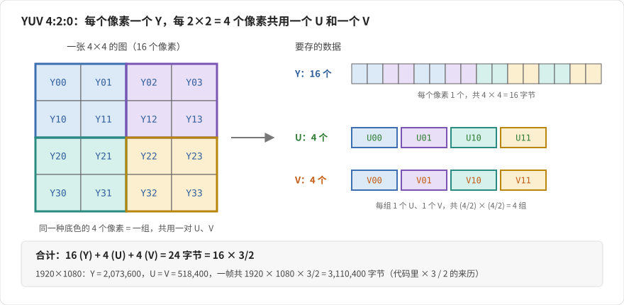
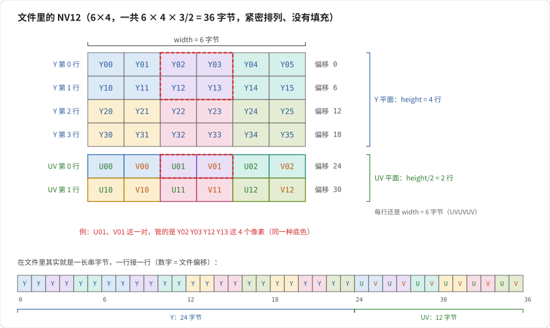
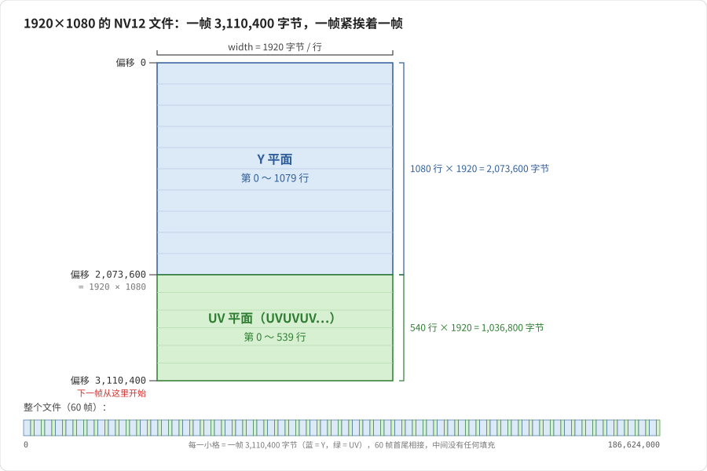
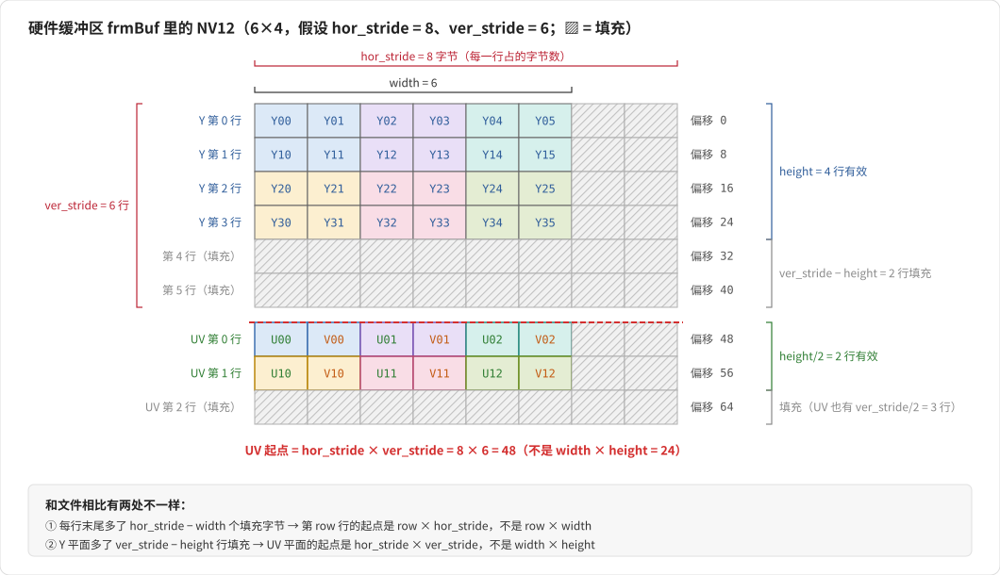
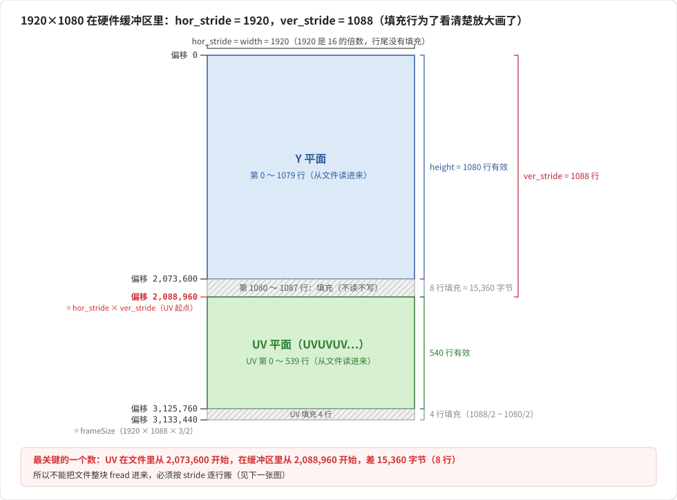
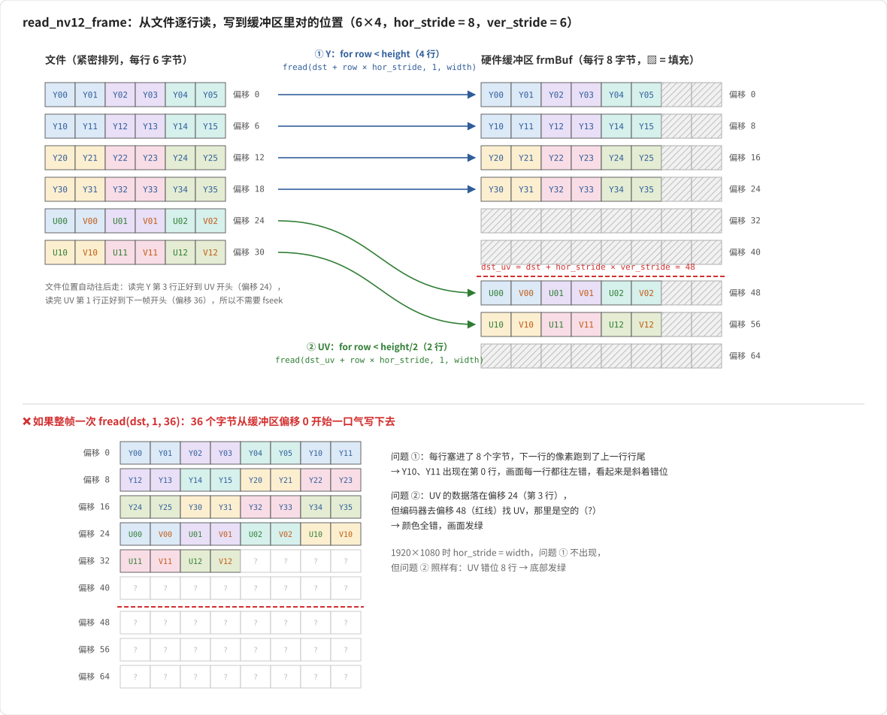
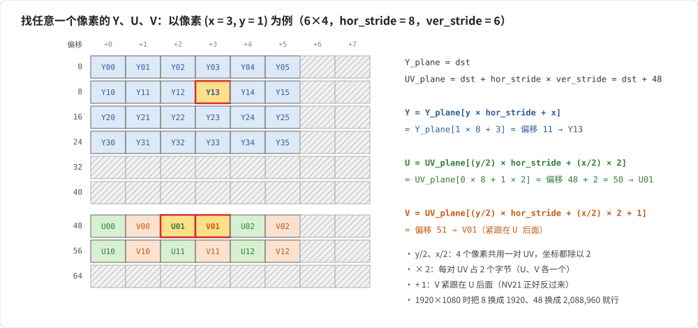
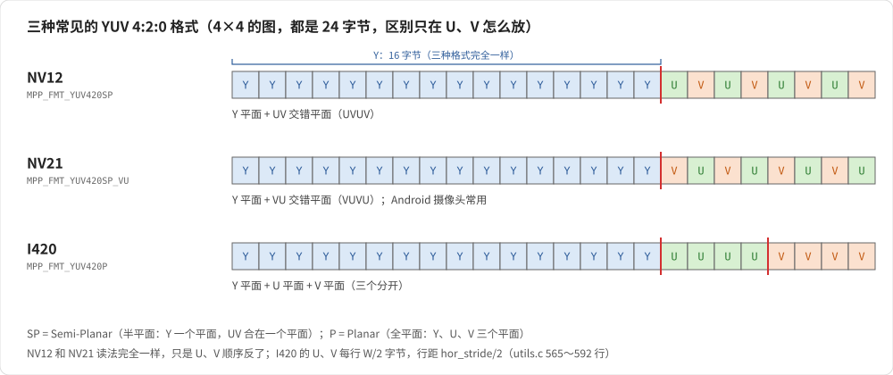

# NV12 中 YUV 的分布和读取方式

> 配合 `read_nv12_frame()`（流程文档 M3）一起看。弄懂这篇，就弄懂了 M3 最难的部分。
> 图都在 `img/nv12/`，由同目录的 `gen_nv12_svg.py` 生成：改图就改脚本，再执行 `python3 gen_nv12_svg.py .` 重新生成。
> 图例：蓝色 = Y，绿色 = U，橙色 = V，斜线格 = 填充；同一种底色 = 同一个 2×2 像素组（共用同一对 U、V）。

---

## 1. 先弄清楚 YUV 4:2:0 是什么

一张图的每个像素，用 3 个分量描述：
- **Y**：亮度（黑白画面就只有 Y）
- **U（Cb）、V（Cr）**：色度（颜色信息）

人眼对亮度敏感、对颜色不敏感，所以 **4:2:0** 这样省空间：
**每个像素都有自己的 Y，但每 2×2 = 4 个像素共用一对 U、V。**



所以一张 `W × H` 的图：
| 分量 | 个数 | 1920×1080 时 |
|---|---|---|
| Y | `W × H` | 2,073,600 |
| U | `(W/2) × (H/2)` | 518,400 |
| V | `(W/2) × (H/2)` | 518,400 |
| **合计** | **`W × H × 3 / 2`** | **3,110,400 字节** |

这就是代码里 `× 3 / 2` 的来历：Y 占 1 份，U+V 一共占 0.5 份。

---

## 2. NV12 在文件里怎么排（紧密排列，没有 stride）

NV12 = **两个平面**：
1. **Y 平面**：所有 Y，一行接一行
2. **UV 平面**：U、V **交错**存放（UVUV...），也是一行接一行

### 2.1 用一张 6×4 的小图举例



要点：
- **UV 平面只有 `H/2` 行**（4 行 Y → 2 行 UV），因为上下 2 行共用。
- **UV 每一行还是 `W` 个字节**：一行有 `W/2` 个 U 和 `W/2` 个 V，交错起来正好 `W` 个字节。
- 每一对 `Uxy Vxy` 管左右 2 个、上下 2 个像素。比如 `U01 V01` 管 `Y02 Y03 Y12 Y13`。

### 2.2 1920×1080 的文件



文件里**没有任何填充**：第 2 帧从偏移 3,110,400 开始，60 帧一共 186,624,000 字节。

---

## 3. NV12 在 MPP 硬件缓冲区里怎么排（有 stride）

硬件编码器要求**按 16 对齐**：
- `hor_stride = ALIGN(width, 16)`：**一行占多少字节**（行宽对齐）
- `ver_stride = ALIGN(height, 16)`：**Y 平面占多少行**（行数对齐），决定了 UV 平面从哪里开始

### 3.1 还是 6×4 的小图，假设 `hor_stride = 8`、`ver_stride = 6`

（真实情况是按 16 对齐，这里用 8 和 6 是为了把图画小）



和文件对比，有两处不一样：
1. **每行末尾多了 `hor_stride - width` 个填充字节** → 每行的起点是 `row × hor_stride`，不是 `row × width`
2. **Y 平面多了 `ver_stride - height` 行填充** → UV 平面的起点是 `hor_stride × ver_stride`，不是 `width × height`

### 3.2 1920×1080 的真实情况

```
hor_stride = ALIGN(1920, 16) = 1920   ← 1920 本来就是 16 的倍数，行尾没有填充
ver_stride = ALIGN(1080, 16) = 1088   ← 多了 8 行填充
```



**最关键的一个数**：UV 在文件里从 **2,073,600** 开始，在缓冲区里从 **2,088,960** 开始，差了 15,360 字节（8 行）。

---

## 4. 用 fread 读一帧

### 4.1 为什么不能一次 fread 整帧

```cpp
fread(dst, 1, 3110400, fp);   // ❌ 错误
```
文件是紧密排列的，一次读进来，UV 会落在缓冲区偏移 2,073,600 的位置。但编码器去 **2,088,960** 找 UV（它是按 `hor_stride × ver_stride` 算的），结果：
- UV 的前 8 行被当成了 Y 的填充行，没人用
- 编码器读到的 UV 整体错位了 8 行，还多读了 8 行垃圾
- 画面表现：**颜色上下错位，底部发绿**

如果宽度不是 16 的倍数（比如 1366），行尾也有填充，整块读进来每一行都会往左偏，画面**斜着错位**。

### 4.2 正确做法：逐行读，每行写到对的位置

下图上半部分是 `read_nv12_frame` 做的事：文件里的每一行，搬到缓冲区里对应的那一行；下半部分是整帧一次 `fread` 会变成什么样。



```cpp
static bool read_nv12_frame(FILE* fp, uint8_t* dst,
                            int width, int height, int hor_stride, int ver_stride) {
    // ① Y：height 行，每行从文件读 width 字节，写到 row * hor_stride 的位置
    for (int row = 0; row < height; row++) {
        if (fread(dst + row * hor_stride, 1, width, fp) != (size_t)width)
            return false;
    }
    // ② UV：从 hor_stride * ver_stride 开始（第 1088 行，不是第 1080 行）
    //    只有 height/2 行，但每行还是 width 字节（U、V 交错：UVUV...）
    uint8_t* dst_uv = dst + hor_stride * ver_stride;
    for (int row = 0; row < height / 2; row++) {
        if (fread(dst_uv + row * hor_stride, 1, width, fp) != (size_t)width)
            return false;
    }
    return true;
}
```

### 4.3 逐句解释

| 代码 | 意思 |
|---|---|
| `fread(目标地址, 1, width, fp)` | 从文件**当前位置**读 `width` 个字节，读完文件位置自动往后挪 `width` |
| `dst + row * hor_stride` | 第 `row` 行在缓冲区里的起点。跳过的是 `hor_stride`，所以每行末尾的填充被留空 |
| Y 循环 `row < height` | 只读 1080 行有效数据，第 1080～1087 行填充不碰 |
| `dst_uv = dst + hor_stride * ver_stride` | 直接跳到第 1088 行，跳过填充行 |
| UV 循环 `row < height / 2` | UV 只有 540 行 |
| UV 每行读 `width`（不是 `width/2`） | 一行里 U、V 各 `width/2` 个，交错起来 `width` 字节 |
| `!= (size_t)width` 就 `return false` | 读不满一行 = 文件读完了（或者文件大小不对）→ 告诉调用方没有下一帧了 |

**fread 不需要 seek**：文件是紧密排列的，读完 Y 的最后一行，文件位置正好停在 UV 的开头；读完 UV 的最后一行，正好停在下一帧的开头。所以 M4 里循环调用这个函数就能一帧一帧往下读。

### 4.4 1920×1080 时，前后几行的读写位置

| 读的是 | 文件偏移（读） | 缓冲区偏移（写） | 说明 |
|---|---|---|---|
| Y 第 0 行 | 0 | 0 | |
| Y 第 1 行 | 1,920 | 1,920 | `hor_stride == width`，Y 部分两边一样 |
| Y 第 1079 行 | 2,071,680 | 2,071,680 | |
| （填充 8 行） | — | 2,073,600～2,088,959 | 不读不写 |
| **UV 第 0 行** | **2,073,600** | **2,088,960** | ⭐ 从这里开始两边差 15,360 |
| UV 第 539 行 | 3,108,480 | 3,123,840 | |
| 下一帧 Y 第 0 行 | 3,110,400 | 0 | 同一块 `frmBuf` 重复使用 |

---

## 5. 找任意一个像素的 Y、U、V

设像素坐标 `(x, y)`，`dst` 是缓冲区起点：

```cpp
uint8_t* Y_plane  = dst;
uint8_t* UV_plane = dst + hor_stride * ver_stride;

uint8_t Y = Y_plane [ y      * hor_stride +  x              ];
uint8_t U = UV_plane[(y / 2) * hor_stride + (x / 2) * 2     ];
uint8_t V = UV_plane[(y / 2) * hor_stride + (x / 2) * 2 + 1 ];
```

- `y / 2`、`x / 2`：4 个像素共用一对 UV，所以坐标都除以 2
- `* 2`：每对 UV 占 2 个字节（U、V 各一个）
- `+ 1`：V 紧跟在 U 后面



例：像素 `(3, 1)` → Y 在 `1 × 1920 + 3`；U 在 UV 平面的 `0 × 1920 + 1 × 2 = 2`，V 在 `3`，也就是 6×4 例子里的 `U01 V01`。

---

## 6. 和其他 YUV 4:2:0 格式对比

| 格式 | 排列 | MPP 里的名字 | 读法区别 |
|---|---|---|---|
| **NV12** | Y 平面 + UV 交错平面（UVUV） | `MPP_FMT_YUV420SP` | 本文 |
| **NV21** | Y 平面 + VU 交错平面（VUVU） | `MPP_FMT_YUV420SP_VU` | 和 NV12 读法**完全一样**，只是 U、V 顺序反了；Android 摄像头常用 |
| **I420 / YUV420P** | Y 平面 + U 平面 + V 平面（三个分开） | `MPP_FMT_YUV420P` | U、V 各 `H/2` 行、每行 `W/2` 字节，行距 `hor_stride/2`（见 `utils.c` 565～592 行） |



`SP` = Semi-Planar（半平面：Y 一个平面，UV 合在一个平面）；`P` = Planar（全平面：Y、U、V 三个平面）。

---

## 7. 常见错误和画面表现

| 错误写法 | 画面表现 |
|---|---|
| 整帧一次 `fread` | 底部发绿、颜色上下错位；宽度不对齐时整个画面斜着错位 |
| UV 起点写成 `width * height` | 底部绿条、颜色错位 |
| UV 每行读 `width / 2` | 每行只读了一半 UV，颜色错乱；文件位置也没走到下一帧的开头，后面每一帧都错位 |
| UV 读 `height` 行（没除以 2） | 多读了 540 行，把下一帧的 Y 当成 UV 读了；而且写到 `2,088,960 + 1080 × 1920 = 4,162,560`，超出了 3,133,440 字节的缓冲区，**越界写内存**，可能直接崩溃 |
| Y 每行用 `row * width` 当写入位置 | 宽度不是 16 的倍数时画面斜着错位 |
| 写完没调用 `mpp_buffer_sync_end` | 花屏、残影（硬件读到缓存里还没刷下去的旧数据） |

---

## 8. 自己动手验证

**在 Mac 上直接播放原始 NV12 文件**（确认素材本身没问题）：
```bash
FF=/usr/local/ffmpeg/4.4/bin
$FF/ffplay -f rawvideo -pixel_format nv12 -video_size 1920x1080 \
    /Users/dev/Documents/AV/rk_test_data/in_1080p_60f.nv12
```

**故意用错误的格式播放，感受一下错位是什么样子**：
```bash
# 当成 I420 播放：Y 正常，颜色全乱
$FF/ffplay -f rawvideo -pixel_format yuv420p -video_size 1920x1080 in_1080p_60f.nv12

# 宽度写错一个像素：画面斜着错位
$FF/ffplay -f rawvideo -pixel_format nv12 -video_size 1919x1080 in_1080p_60f.nv12
```

**用 xxd 看第一帧 UV 的开头**（文件偏移 2,073,600 = 0x1FA400）：
```bash
xxd -s 2073600 -l 32 in_1080p_60f.nv12
# 实际输出：
# 001fa400: 7190 7190 7190 7190 7190 7190 7190 7190  q.q.q.q.q.q.q.q.
# 001fa410: 7090 7090 7090 7090 7090 7090 7090 7090  p.p.p.p.p.p.p.p.
#           ↑↑ ↑↑
#           U  V   ← U=0x71(113)、V=0x90(144) 一对一对交替出现，这就是"UV 交错"
# 值都在 128 附近：128 表示没有颜色偏移，越偏离 128 颜色越浓
```
