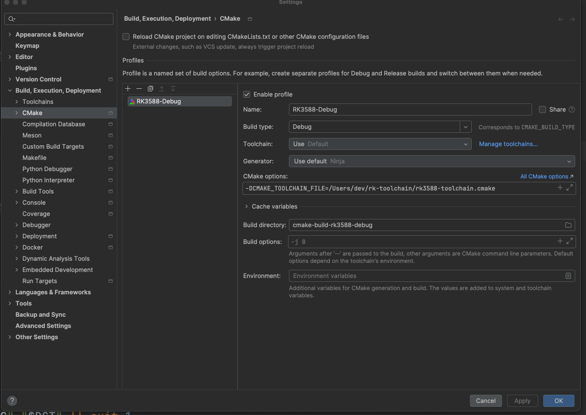
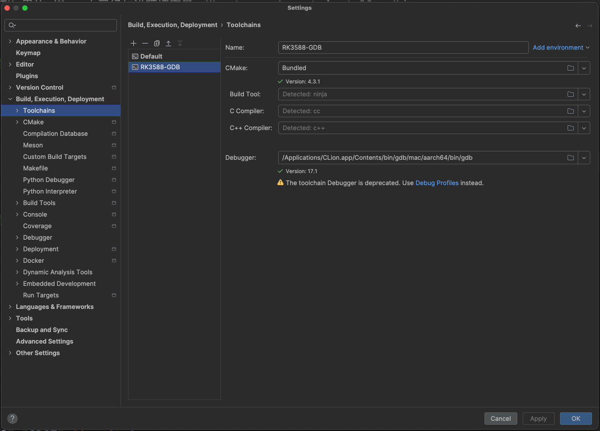
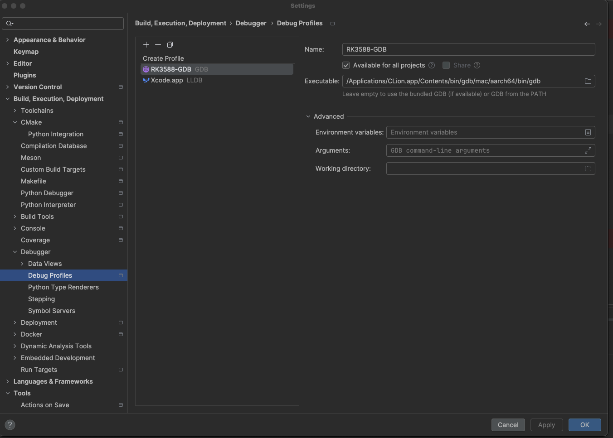
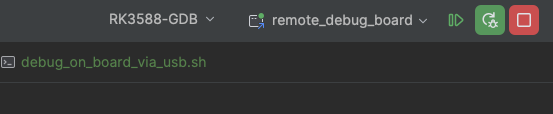
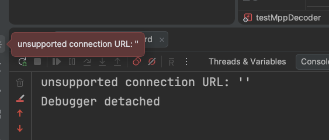
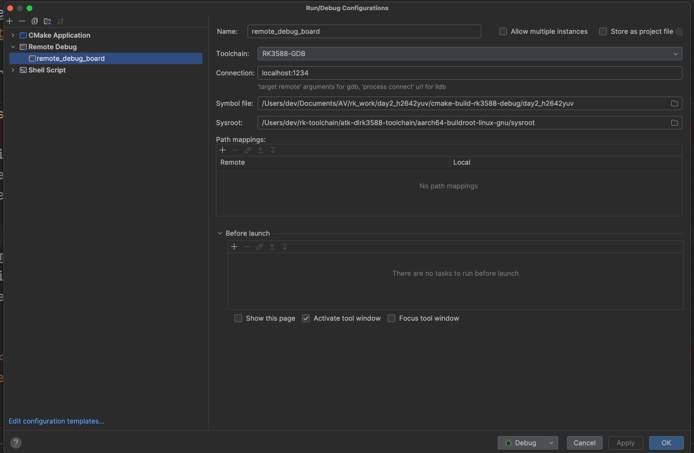

# 01 · 环境准备

> 和 Day 1 基本一样，这里只列 Day 2 要做的事。Day 1 的详细说明见 [../../day1_yuv2h264/guide/01_环境准备.md](../../day1_yuv2h264/guide/01_环境准备.md)。
> 板子连接一律走 USB（adb），不用 IP。

---

## 1. CLion：新建 RK3588-Debug profile

工程是 CLion 新建的，默认只有一个 `Debug` profile（Mac 本地编译，找不到 `rockchip/rk_mpi.h`）。要新建交叉编译的 profile：

`Settings → Build, Execution, Deployment → CMake → +`

| 项 | 填什么 |
|---|---|
| Name | `RK3588-Debug` |
| Build type | `Debug` |
| CMake options | `-DCMAKE_TOOLCHAIN_FILE=/Users/dev/rk-toolchain/rk3588-toolchain.cmake` |
| Build directory | `cmake-build-rk3588-debug`（脚本从这里找程序，名字不能错） |



然后主工具栏把 profile 切到 `RK3588-Debug`。编出来的程序在 `cmake-build-rk3588-debug/day2_h2642yuv`。

> 原来的 `Debug` profile 可以删掉，也可以留着（编不过是正常的）。

---

## 2. CLion：调试用的 GDB（`RK3588-GDB`）

板子上的程序是 aarch64 Linux 程序，要用 **GDB** 调试。CLion 在 Mac 上默认用 Xcode 的 **LLDB**，所以要额外配置。这里有**两处**都叫 `RK3588-GDB`，作用不一样：

| 在哪 | 是什么 | 起不起作用 |
|---|---|---|
| Settings → Build, Execution, Deployment → **Toolchains** | 工具链 `RK3588-GDB` | 只是给 Remote Debug 配置的 Toolchain 字段选用；它里面的 Debugger 设置**已经不起作用** |
| Settings → Build, Execution, Deployment → **Debugger → Debug Profiles** | Debug Profile `RK3588-GDB` | **真正决定用 GDB 还是 LLDB**，并且**还要在主工具栏选中它**（2.3） |

一共 4 步：2.1 工具链 → 2.2 Debug Profile → 2.3 主工具栏选中 → 2.4 Remote Debug 配置。最容易漏的是 **2.3**。

### 2.1 工具链 `RK3588-GDB`（Settings → Toolchains）



| 字段 | 值 | 说明 |
|---|---|---|
| Name | `RK3588-GDB` | |
| CMake | `Bundled`（4.3.1） | CLion 自带的 CMake |
| Build Tool | `Detected: ninja` | |
| C / C++ Compiler | `Detected: cc` / `Detected: c++` | 这里是 Mac 本机的编译器，**不用改**。交叉编译器是 CMake profile 里的 `CMAKE_TOOLCHAIN_FILE` 指定的（见第 1 节） |
| Debugger | `/Applications/CLion.app/Contents/bin/gdb/mac/aarch64/bin/gdb`（17.1） | CLion 自带的 GDB，支持 aarch64 |

> ⚠️ Debugger 下面有一行黄字："The toolchain Debugger is deprecated. Use Debug Profiles instead."意思是：**这里设成 GDB 已经没用了**，实际调试时用哪个调试器由 2.2 + 2.3 决定。

工具链是 CLion 的全局设置，Day 1 建过，Day 2 能直接看到。

**CMake profile 的 Toolchain 字段**（第 1 节）保持 `Use Default` 就行：编译只靠 `CMAKE_TOOLCHAIN_FILE`，和这个工具链无关。如果 Toolchains 列表里只剩 `RK3588-GDB`（`Default` 被删了），`Use Default` 就会用它，也没影响，因为编译器一样是 `cc`/`c++`。

### 2.2 Debug Profile `RK3588-GDB`（Settings → Debugger → Debug Profiles）



| 字段 | 值 |
|---|---|
| 类型 | GDB（点 `+` 时选） |
| Name | `RK3588-GDB` |
| Available for all projects | **勾上**，Day 3、4、5 就不用再建了 |
| Executable | `/Applications/CLion.app/Contents/bin/gdb/mac/aarch64/bin/gdb` |
| Advanced | 都留空 |

列表里另一个 `Xcode.app (LLDB)` 是 CLion 原来默认的，**不要删**，Mac 上调试本机程序还要用它。

### 2.3 ⭐ 在主工具栏选中 `RK3588-GDB`（最容易漏的一步）

**只建了 Debug Profile 还不够**。CLion 是**按运行配置**分别记住用哪个 Debug Profile 的，新建的运行配置默认用 `Xcode.app (LLDB)`。

CLion 顶部：

1. 先在运行配置下拉框里选中 Remote Debug 配置 **`remote_debug_board`**
2. 再在它**左边**的 Debug Profile 下拉框里选 **`RK3588-GDB`**

选对以后是这样：



> 这两个下拉框挨在一起，看起来像一个控件，所以容易漏。Day 2 第一次调试就是漏了这一步：2.2 的 Profile 已经建好了，但主工具栏还是 `Xcode.app`，结果用的是 LLDB，报错：
>
> 
>
> `unsupported connection URL: ''` 是 **LLDB** 的报错（LLDB 不认 `localhost:1234` 这种 GDB 的 `target remote` 写法），看到它就说明用的不是 GDB，回来检查这一步。

### 2.4 Day 2 的 Remote Debug 配置 `remote_debug_board`

**Run → Edit Configurations… → `+` → Remote Debug**（和 Day 1 一样，详细说明见 [Day 1 的 USB 调试文档](../../day1_yuv2h264/doc/用usb连接并调试板子.md) 4.3 节），只有 **Symbol file** 要换成 Day 2 的程序：



| 字段 | 值 | 说明 |
|---|---|---|
| Name | `remote_debug_board` | |
| Toolchain | `RK3588-GDB` | 2.1 的工具链 |
| Connection | `localhost:1234` | 不是板子 IP：adb 把本机 1234 转发到板子的 gdbserver |
| Symbol file | `/Users/dev/Documents/AV/rk_work/day2_h2642yuv/cmake-build-rk3588-debug/day2_h2642yuv` | Mac 上那份带调试信息的程序 |
| Sysroot | `/Users/dev/rk-toolchain/atk-dlrk3588-toolchain/aarch64-buildroot-linux-gnu/sysroot` | |
| Path mappings | 留空 | |
| Before launch | **留空** | gdbserver 脚本要一直在前台运行，放这里 CLion 会一直等它结束，卡住 |

### 2.5 调试的顺序

1. 在代码里打断点
2. 运行 `../run_debug_on_board_via_usb.sh`（Shell Script 配置），等终端出现 **`Listening on port 1234`**
3. 确认主工具栏是 **`RK3588-GDB` + `remote_debug_board`**（2.3）
4. 点 Debug 按钮，停在断点上

| 现象 | 原因 | 怎么办 |
|---|---|---|
| `unsupported connection URL: ''`，然后 `Debugger detached` | 主工具栏的 Debug Profile 还是 `Xcode.app`，用的是 LLDB | 按 2.3 选成 `RK3588-GDB` |
| 连不上 / `Connection refused` | gdbserver 还没起来，或者已经退出了 | 先运行第 2 步的脚本，看到 `Listening on port 1234` 再点 Debug |
| 断点不停 | Symbol file 指到了别的程序，或者没用 Debug 模式编译 | 检查 2.4 的 Symbol file；CMake profile 的 Build type 是 `Debug` |

---

## 3. 脚本（已经从 Day 1 复制好，改了程序名）

| 脚本 | 做什么 |
|---|---|
| `run_on_board_with_mac.sh [参数...]` | 编译 → `adb push` 到板子 `/tmp/CLion/run` → 运行，输出显示在当前终端 |
| `debug_on_board_via_usb.sh [参数...]` | 编译 → push 到 `/tmp/CLion/debug` → 板子上启动 gdbserver，等 CLion 连上来调试（见 [Day 1 的 USB 调试文档](../../day1_yuv2h264/doc/用usb连接并调试板子.md)） |
| `run_move_file_to_board_via_usb.sh [文件]` | 把测试素材传到板子 `/userdata/av/`，默认传 `aaa.264` |

CLion 里照 Day 1 新建两个运行配置（Shell Script）指向前两个脚本，参数填在 **Script options** 里。

---

## 4. 测试素材：aaa.264

| 项 | 值 |
|---|---|
| Mac 上的位置 | `/Users/dev/Documents/AV/rk_test_data/aaa.264` |
| 格式 | H.264 **Constrained Baseline**，Level 4.0 |
| 分辨率 / 帧率 | 1920×1080，29.97fps |
| 帧数 | **1803 帧**（39 个 I 帧 + 1764 个 P 帧，没有 B 帧），约 60 秒 |
| 大小 | 55.7MB |

（帧数和帧类型是用 `ffprobe -count_frames` / `-show_frames` 在 Mac 上实测的。）

传到板子：

```bash
./run_move_file_to_board_via_usb.sh          # → /userdata/av/aaa.264
```

先看看板子空间够不够（解码输出很大）：

```bash
adb shell "df -h /userdata"
```

| 输出 | 大小 |
|---|---|
| 1 帧 NV12 | 3,110,400 字节 ≈ 3MB |
| `-n 60` | ≈ 187MB |
| `-n 300` | ≈ 933MB |
| 全部 1803 帧 | ≈ **5.6GB** —— 别这么干 |

Day 1 编出来的 `out.h264` / `out.h265`（60 帧）也可以拿来解码，晚上的实验会用到。

---

## 5. 板子上的 MPP 库

和 Day 1 一样：出厂的 `/usr/lib/librockchip_mpp` 太旧，要用 `/userdata/mpp_build/lib` 里自己编译的那份。`CMakeLists.txt` 里已经加了 rpath，`run_on_board_with_mac.sh` 也设了 `LD_LIBRARY_PATH`，不用额外处理。

官方的解码测试程序也在那里，可以拿来对比：

```bash
adb shell "ls /userdata/mpp_build/bin"      # 看看有没有 mpi_dec_test
adb shell "cd /userdata/av && LD_LIBRARY_PATH=/userdata/mpp_build/lib /userdata/mpp_build/bin/mpi_dec_test -t 7 -i aaa.264 -n 300"
```

`-t 7` 是 `MPP_VIDEO_CodingAVC`（H.264）的枚举值，H.265 是 `-t 16777220`（`MPP_VIDEO_CodingHEVC`）。

---

## 6. Mac 上看结果

```bash
FF=/usr/local/ffmpeg/4.4/bin
adb pull /userdata/av/out.nv12 .
$FF/ffplay -f rawvideo -pixel_format nv12 -video_size 1920x1080 out.nv12        # 播放
$FF/ffplay -f rawvideo -pixel_format nv12 -video_size 1920x1080 -vf "select=eq(n\,0)" out.nv12   # 只看第 0 帧
```

`-video_size` 必须写对（NV12 文件里没有宽高信息）。写成 `1920x1088` 去播放按 `width × height` 写出的文件，画面会斜着错位。
