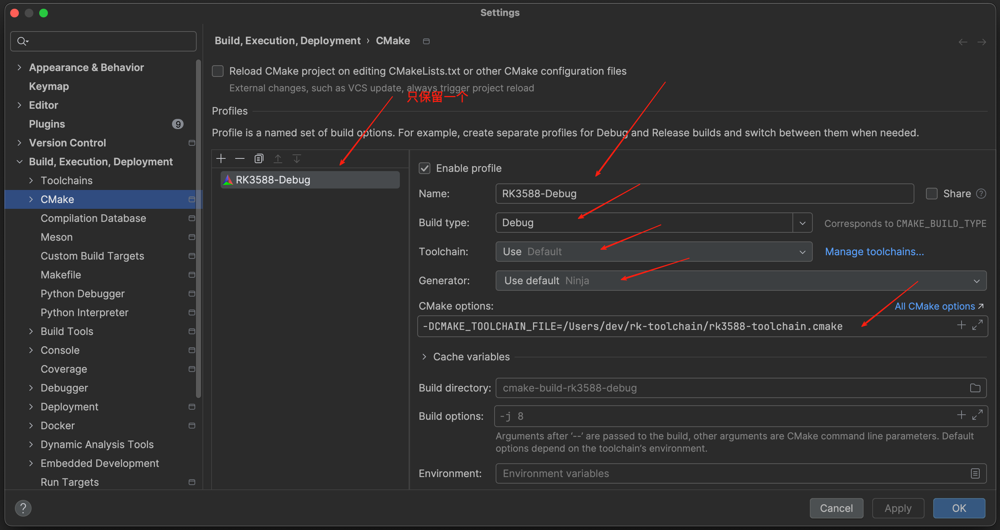
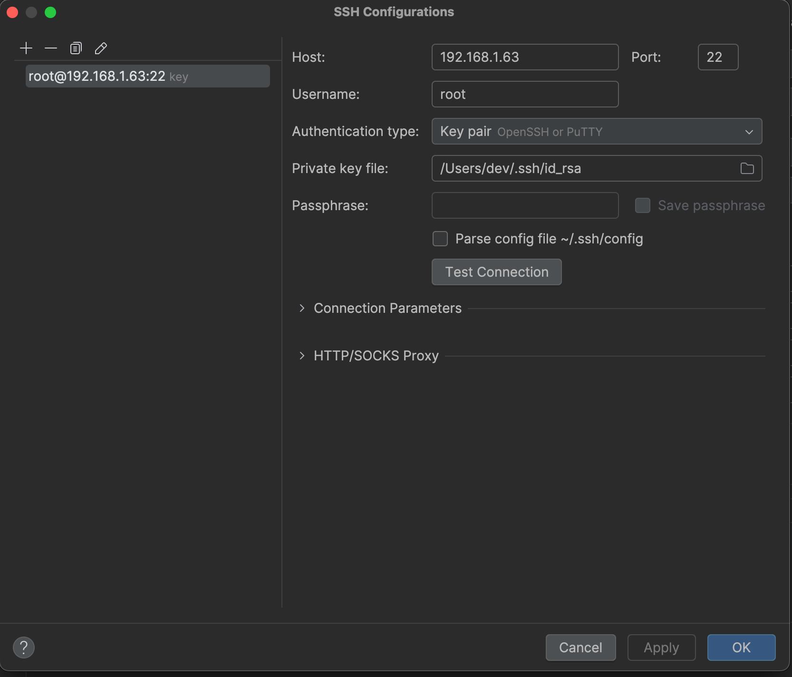
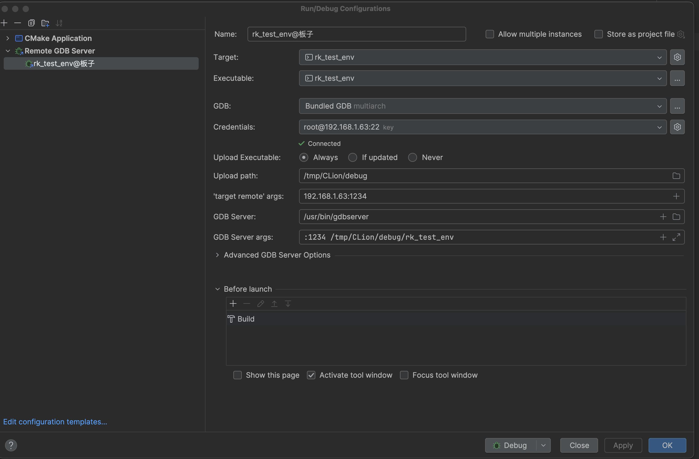
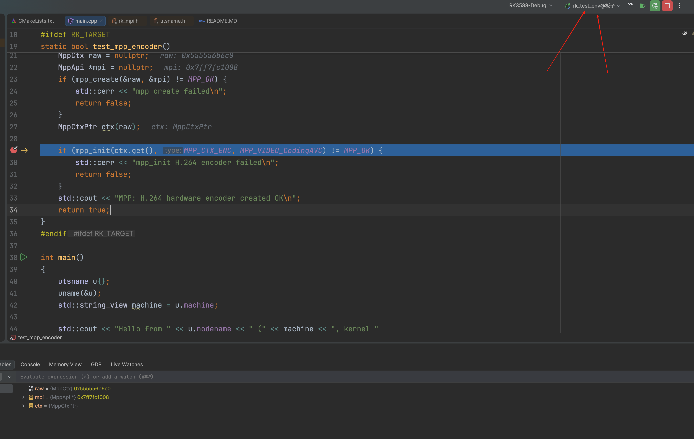
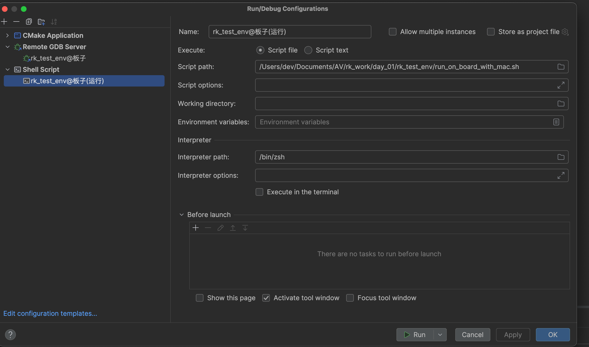

# 在 Mac（M 系列芯片）上搭建 RK3588 开发调试环境

> **目标**：在 Mac 上用 CLion 写代码 → 一键交叉编译 → 自动上传到 RK3588 开发板 → **断点调试**
> **环境**：MacBook（Apple M4，macOS 15）+ 正点原子 ATK-DLRK3588（Linux 5.10 Buildroot）+ CLion 2026.2.1
> **完成日期**：2026-10-01 ✅ 已验证：断点停在 `mpp_init` 一行，能查看 MPP 变量

---

## 一、整体原理

```
┌──────────────────────── Mac ────────────────────────┐            ┌──────── RK3588 开发板 ────────┐
│                                                      │            │                                │
│  CLion                                               │            │                                │
│   ├─ CMake（RK3588-Debug 配置 + 工具链文件）           │            │                                │
│   ├─ 编译器转发脚本 ──► OrbStack 的 rk-dev ──► gcc 10.4│            │                                │
│   │                    （x86 Ubuntu，Rosetta 运行）    │  SSH 上传  │  /tmp/CLion/debug/rk_test_env  │
│   ├─ 生成 aarch64 程序 ───────────────────────────────┼───────────►│                                │
│   │                                                  │            │  gdbserver :1234（自动启动）    │
│   └─ Bundled GDB（multiarch）◄────────────────────────┼── 网络 ────┤                                │
│        断点 / 单步 / 查看变量                          │  :1234     │                                │
└──────────────────────────────────────────────────────┘            └────────────────────────────────┘
```

**几个关键点**：
1. 正点原子的交叉编译器是 **x86_64 Linux 程序**，Mac（ARM）不能直接运行，所以放在 OrbStack 的 x86 Ubuntu 虚拟机（`rk-dev`）里运行。
2. 工具链放在 `/Users/dev/rk-toolchain/`，**Mac 和 rk-dev 用同一个路径都能访问**，所以：
   - CLion 能直接读取 sysroot 里的头文件，代码补全和跳转都正常
   - 编译命令、源码路径不需要做任何转换
3. 调试用 **CLion 自带的 GDB（multiarch 版）**，它支持 aarch64，板子上运行**自带的 gdbserver**。

---

## 二、准备工作

### 2.1 Mac 上需要有的东西

| 组件 | 位置 / 版本 | 用途 |
|---|---|---|
| OrbStack + 虚拟机 `rk-dev` | amd64 Ubuntu 22.04 | 运行 x86 的交叉编译器 |
| 交叉编译工具链 | `/Users/dev/rk-toolchain/atk-dlrk3588-toolchain/`（gcc 10.4，3.7GB） | 来自 A 盘 `05、开发工具/03、交叉编译工具/linux5.10/*.run` |
| 编译器转发脚本 | `/Users/dev/rk-toolchain/mac-bin/aarch64-buildroot-linux-gnu-*` | Mac 上调用 → 转到 rk-dev 里执行 |
| **CMake 工具链文件** | `/Users/dev/rk-toolchain/rk3588-toolchain.cmake` | 告诉 CMake 目标平台、编译器、sysroot |
| CLion | 2026.2.1 | IDE（自带 CMake 4.3、Ninja、GDB multiarch） |
| adb | `~/Documents/Android_Env/sdk/platform-tools/adb` | 通过 USB 连板子 |

### 2.2 开发板上需要有的东西

| 组件 | 状态 |
|---|---|
| gdbserver | ✅ 出厂系统**自带** `/usr/bin/gdbserver` |
| SSH 服务 | ✅ 出厂自带，root 密码 `root` |
| 网络 | 板子连 Wi-Fi（和 Mac 在同一个局域网） |

---

## 三、如何查看板子的 IP

板子用 Wi-Fi，**IP 由路由器 DHCP 分配，每次开机可能不一样**（实测出现过 `.5` 和 `.63`）。

| 方法 | 命令 | 说明 |
|---|---|---|
| **adb（推荐）** | `adb shell ip -4 addr \| grep inet` | USB 线接 OTG 口，不依赖网络 |
| 串口 | `tio -b 1500000 /dev/cu.usbmodem*`，登录后执行 `ip -4 addr` | 调试串口接 UART 口 |
| 路由器后台 | 在已连接设备列表里找 `ATK-DLRK3588` | — |

输出示例：
```
inet 192.168.1.63/24 brd 192.168.1.255 scope global wlan0     ← 板子的 IP
```

> 💡 **建议**：在路由器里给板子**绑定固定 IP**（按 MAC 地址做 DHCP 静态分配），这样 CLion 里的配置就不用反复改。
> IP 变了以后，要改两个地方：**SSH Credentials 的 Host**，以及 **'target remote' args**。

### 配置 SSH 免密登录（只需要做一次）
通过 adb 把 Mac 的公钥放到板子上：
```bash
adb push ~/.ssh/id_rsa.pub /tmp/mac_key.pub
adb shell 'mkdir -p /root/.ssh && chmod 700 /root/.ssh && cat /tmp/mac_key.pub >> /root/.ssh/authorized_keys && chmod 600 /root/.ssh/authorized_keys'
ssh root@192.168.1.63 hostname      # 不需要输密码，输出 ATK-DLRK3588 就成功了
```

---

## 四、工具链配置（所有 RK3588 工程共用，只需要做一次）

### 4.1 复制工具链到 Mac 能访问的路径
```bash
orb -m rk-dev -u root bash -c 'mkdir -p /Users/dev/rk-toolchain && cp -a /opt/atk-dlrk3588-toolchain /Users/dev/rk-toolchain/'
```
> 复制时会报几条 `terminfo/M: File exists`：Mac 的磁盘不区分大小写，`M` 和 `m` 冲突了。这些是终端配置文件，**不影响编译**。

### 4.2 编译器转发脚本
`/Users/dev/rk-toolchain/mac-bin/rk-tool-wrapper`：
```sh
#!/bin/sh
RK_TOOLCHAIN=/Users/dev/rk-toolchain/atk-dlrk3588-toolchain
ORB=/Applications/OrbStack.app/Contents/MacOS/bin/orb
exec "$ORB" -m rk-dev "$RK_TOOLCHAIN/bin/$(basename "$0")" "$@"
```
再给它建一批软链接，名字就是工具名（gcc、g++、ar、strip、objdump……）：
```bash
cd /Users/dev/rk-toolchain/mac-bin && chmod +x rk-tool-wrapper
for t in gcc g++ cpp ar ranlib strip nm objcopy objdump readelf ld addr2line size; do
  ln -sf rk-tool-wrapper aarch64-buildroot-linux-gnu-$t
done
./aarch64-buildroot-linux-gnu-g++ --version    # 显示 10.4.0 就成功了
```

### 4.3 CMake 工具链文件
`/Users/dev/rk-toolchain/rk3588-toolchain.cmake` 的关键内容：

| 设置项 | 值 | 作用 |
|---|---|---|
| `CMAKE_SYSTEM_NAME` | `Linux` | 目标系统 |
| `CMAKE_SYSTEM_PROCESSOR` | `aarch64` | 目标 CPU 架构 |
| `CMAKE_C_COMPILER` / `CMAKE_CXX_COMPILER` | `mac-bin/aarch64-buildroot-linux-gnu-gcc` / `g++` | 转发脚本 |
| `CMAKE_SYSROOT` | `.../atk-dlrk3588-toolchain/aarch64-buildroot-linux-gnu/sysroot` | 板子系统的头文件和库（MPP、RGA、FFmpeg……） |
| `CMAKE_FIND_ROOT_PATH_MODE_*` | 库、头文件、包：`ONLY`；程序：`NEVER` | 只在 sysroot 里找库，不会误用 Mac 本机的库 |
| `PKG_CONFIG_SYSROOT_DIR` / `PKG_CONFIG_LIBDIR` | 指向 sysroot | `pkg_check_modules` 也从 sysroot 里查 |

---

## 五、CLion：配置 CMake

**菜单 CLion → Settings（`Cmd + ,`）→ Build, Execution, Deployment → CMake → 点 `+`**

| 字段 | 填什么 | 说明 |
|---|---|---|
| Name | `RK3588-Debug` | |
| Build type | `Debug` | 带调试信息（`-g`） |
| Toolchain | `Default` | 保持不变，交叉编译器由下面的工具链文件指定 |
| Generator | `Ninja`（Use default） | |
| **CMake options** | `-DCMAKE_TOOLCHAIN_FILE=/Users/dev/rk-toolchain/rk3588-toolchain.cmake` | ★ 关键 |
| Build directory | `cmake-build-rk3588-debug` | 默认值就行 |



> ⚠️ **删掉原来的 `Debug` 配置**（选中它，点 `−`）。它用的是 Mac 本机编译器，留着的话 CLion 可能会用它来分析代码，导致 `#ifdef RK_TARGET` 里的代码变灰、**`rk_mpi.h` 跳转不了**。
> 删完执行 **File → Reload CMake Project**。

**确认配置成功**：
- `Cmd + F9` 编译，Build 窗口显示 `Linking CXX executable rk_test_env`
- CMake 日志里有 `The CXX compiler identification is GNU 10.4.0`
- 按住 Cmd 点击 `rk_mpi.h`，能跳到 `/Users/dev/rk-toolchain/.../sysroot/usr/include/rockchip/rk_mpi.h`

---

## 六、CLion：配置 SSH 连接（Credentials）

在下一节的 Remote GDB Server 配置里，点 **Credentials** 右边的 ⚙️ 进入：

| 字段 | 填什么 |
|---|---|
| Host | `192.168.1.63`（板子当前的 IP） |
| Port | `22` |
| Username | `root` |
| Authentication type | **Key pair**（OpenSSH or PuTTY） |
| Private key file | `/Users/dev/.ssh/id_rsa` |
| Passphrase | 空 |

点 **Test Connection**，显示 Successfully connected 就成功了。




> ⚠️ **如果报 `java.net.NoRouteToHostException: No route to host`**：
> 这是 **macOS 15 的"本地网络"权限**拦截了连接。终端里 `ssh` 能连上，但 CLion 连不上。
> **解决**：系统设置 → 隐私与安全性 → **本地网络** → 打开 **CLion** 的开关 → **Cmd + Q 彻底退出 CLion 再重新打开**。

---

## 七、CLion：配置远程运行和调试（Remote GDB Server）

**菜单 Run → Edit Configurations… → 左上角 `+` → 选 `Remote GDB Server`**

| 字段 | 填什么 | 说明 |
|---|---|---|
| Name | `rk_test_env@板子` | 随便取 |
| Target | `rk_test_env` | CMake 里的目标 |
| Executable | `rk_test_env` | |
| **GDB** | **Bundled GDB multiarch** | CLion 自带，支持 aarch64 |
| **Credentials** | `root@192.168.1.63:22`（key） | 上一节配置的 SSH，下方显示 ✓ Connected |
| Upload Executable | `Always` | 每次都上传最新编译的程序 |
| Upload path | `/tmp/CLion/debug` | 程序上传到板子上的这个目录 |
| **'target remote' args** | `192.168.1.63:1234` | GDB 连接板子的地址和端口 |
| **GDB Server** | `/usr/bin/gdbserver` | 板子上自带的 |
| **GDB Server args** | `:1234 /tmp/CLion/debug/rk_test_env` | 端口必须和 target remote 一致 |
| Before launch | `Build` | 调试前自动编译 |



> ⚠️ GDB Server 和 GDB Server args 这两个框，如果显示的是**灰色文字**，那只是提示文字，**要手动输入一遍**，变成白色才算填进去了。

> 💡 **建议删掉 CLion 自动生成的 `CMake Application → rk_test_env` 配置**。它在 Mac 本机运行，选错的话会报 `exit code 127` 或 `failed to launch or debug process`。

---

## 八、开始调试

1. 在代码行号旁边点一下，打上断点（红点）
2. 右上角的运行配置选 **`rk_test_env@板子`**（带绿色小虫图标）
3. 点 🐞 **Debug**

> ⚠️ **Remote GDB Server 配置只能 Debug，▶ Run 按钮是灰色的**（它的原理就是用 gdbserver 调试）。
> 只想运行、不想停在断点上：点 Debug 窗口左边的"静音断点"按钮再 Debug；或者用下一节的**一键运行**配置。

**成功的样子**：
- 程序**停在断点所在的行**（蓝色高亮，旁边有箭头）
- 代码旁边直接显示变量值，比如 `raw: 0x555556b6c0`
- 下方是 **GDB** 标签页（**不是 LLDB**），Variables 里能展开 `raw`、`mpi`、`ctx`
- F8 单步执行，F7 进入函数，F9 继续运行



---

## 八（补充）、一键运行：点 ▶ 在板子上运行

工程根目录下的 [run_on_board_with_mac.sh](../run_on_board_with_mac.sh) 会做四件事：**编译 → 上传程序到板子 → 在板子上运行 → 把输出显示回来**。

**配置方法**：菜单 Run → Edit Configurations… → 左上角 `+` → 选 **`Shell Script`**

| 字段 | 填什么 | 说明 |
|---|---|---|
| Name | `rk_test_env@板子(运行)` | |
| Execute | `Script file` | |
| Script path | `/Users/dev/Documents/AV/rk_work/day_01/rk_test_env/run_on_board_with_mac.sh` | ⚠️ **必须写完整路径**，写 `$PROJECT_DIR$/...` 会报 `Shell script not found`（这个配置不认识这个宏） |
| Script options | 空 | 要给程序传参数就写在这里 |
| Working directory | `/Users/dev/Documents/AV/rk_work/day_01/rk_test_env` | ⚠️ 同样**必须写完整路径**，写 `$PROJECT_DIR$` 会报 `Working directory not found`。也可以留空，因为脚本会自己 `cd` 到所在目录 |
| Interpreter path | `/bin/zsh`（默认值） | |
| Execute in the terminal | **不勾选** | 不勾选的话，输出显示在 Run 窗口里 |
| Before launch | **不用配置** | Shell Script 配置的 Before launch 里没有 Build 选项，所以编译这一步写在脚本里了（调用 CLion 自带的 cmake 编译 `cmake-build-rk3588-debug`） |



使用：右上角选 `rk_test_env@板子(运行)` → 点 ▶，Run 窗口里显示：
```
[1/2] Building CXX object CMakeFiles/rk_test_env.dir/main.cpp.o
[2/2] Linking CXX executable rk_test_env
=== 在 192.168.1.63 上运行 /tmp/CLion/run/rk_test_env ===
Hello from ATK-DLRK3588 (aarch64, kernel 5.10.160)
C++ standard: 201703
MPP: H.264 hardware encoder created OK
```

> 板子 IP 变了：改 `../run_on_board_with_mac.sh` 里的 `BOARD_IP=` 这一行。
> 两个运行配置的分工：**`rk_test_env@板子` 用来调试（🐞）**，**`rk_test_env@板子(运行)` 用来运行（▶）**。

---


## 九、常见问题

| 现象 | 原因 | 解决办法 |
|---|---|---|
| Run 输出 `Process finished with exit code 127` | 选的是 **CMake Application** 配置，在 Mac 上直接运行了 ARM 程序 | 右上角改选 `rk_test_env@板子` |
| Debug 报 `failed to launch or debug process`，下方是 **LLDB** 标签页 | 同上，用的是 Mac 本机的 LLDB | 同上 |
| `rk_mpi.h` 跳转不了，`#ifdef RK_TARGET` 里的代码是灰色的 | CLion 在用 Mac 的 `Debug` 配置分析代码 | 删掉 `Debug` 配置；或者在编辑器右下角把分析配置切换成 `RK3588-Debug` |
| Test Connection 报 `No route to host` | macOS 15 本地网络权限 | 系统设置 → 隐私与安全性 → 本地网络 → 打开 CLion → 重启 CLion |
| `rk_test_env@板子` 的 ▶ Run 是灰色的 | Remote GDB Server 配置只支持 Debug | 用 🐞 Debug；或者用"八（补充）"的一键运行配置 |
| 突然连不上板子了 | 板子重启后 **IP 变了** | 用 `adb shell ip -4 addr` 查新 IP，改 Credentials 的 Host 和 target remote |
| CLion 提示 `Included header memory is not used` | 用了 Mac 的配置来分析代码，误报 | 同"跳转不了"的处理方法 |
| 编译特别慢，或者报 `orb` 相关的错误 | OrbStack 没有运行 | 打开 OrbStack；文件共享出问题时执行 `orb stop && orb start` |
| Mac 上 `~/OrbStack/` 目录变空了 | OrbStack 的文件共享服务掉线了 | `orb stop && orb start` |

---

## 十、新建工程时怎么用

新工程只需要做两件事：
1. **CMake 配置**：按第五节新建 `RK3588-Debug`，CMake options 填工具链文件
2. **运行配置**：按第七节新建 Remote GDB Server，Target 和 Executable 改成新工程的目标，Upload path 和 GDB Server args 里的程序名也要跟着改

`CMakeLists.txt` 里链接 RK 的库，直接写库名就行：
```cmake
if(CMAKE_SYSTEM_PROCESSOR STREQUAL "aarch64")
    target_link_libraries(你的目标 PRIVATE rockchip_mpp)    # MPP 编解码
    # target_link_libraries(你的目标 PRIVATE rga)           # RGA
endif()
```
头文件这样写：`#include <rockchip/rk_mpi.h>`、`#include <rga/im2d.h>`

---

## 十一、命令行备用方法（不用 CLion 的时候）

```bash
# 编译（在工程目录下）
cmake -S . -B build -G Ninja -DCMAKE_TOOLCHAIN_FILE=/Users/dev/rk-toolchain/rk3588-toolchain.cmake
cmake --build build

# 上传并运行
scp build/rk_test_env root@192.168.1.63:/tmp/ && ssh root@192.168.1.63 /tmp/rk_test_env

# 手动远程调试
ssh root@192.168.1.63 'gdbserver :1234 /tmp/rk_test_env' &
/Applications/CLion.app/Contents/bin/gdb/mac/aarch64/bin/gdb \
    -ex "set sysroot /Users/dev/rk-toolchain/atk-dlrk3588-toolchain/aarch64-buildroot-linux-gnu/sysroot" \
    -ex "file build/rk_test_env" -ex "target remote 192.168.1.63:1234" \
    -ex "break main" -ex "continue"
```
