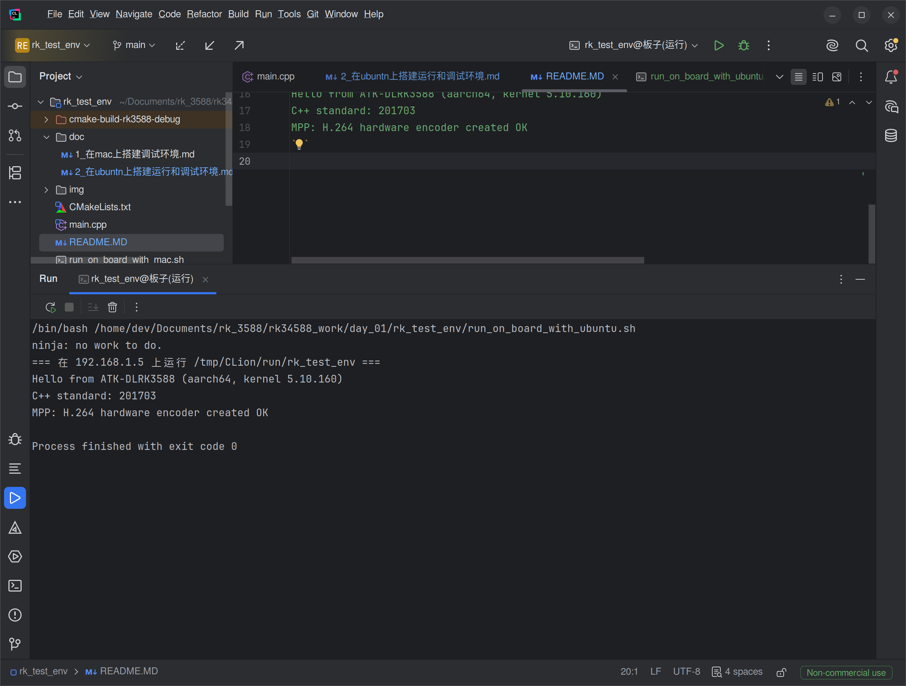
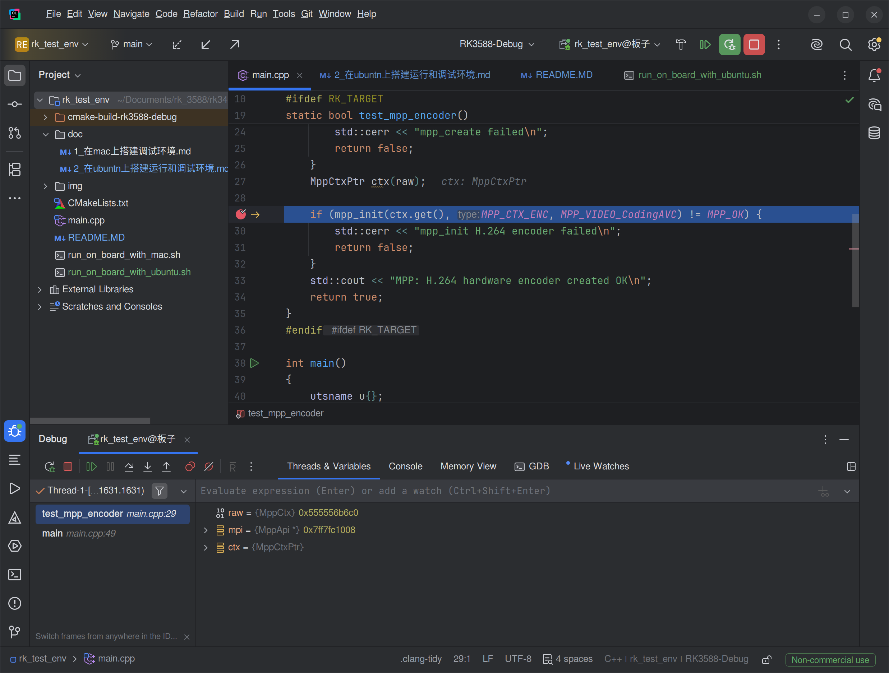

# 在 Ubuntu 上搭建 RK3588 开发调试环境

> **目标**：在 Ubuntu 上用 CLion 写代码 → 一键交叉编译 → 自动上传到 RK3588 开发板 → **断点调试**
> **环境**：Ubuntu 20.04（x86_64，`devp`）+ 正点原子 ATK-DLRK3588（Linux 5.10 Buildroot 出厂系统）+ CLion 2026.1.2（`/home/dev/Documents/IDE/clion-2026.1.2`）
> **进度（2026-10-01）**：
> - ✅ 工具链安装、CMake 工具链文件、SSH 免密、CLion CMake 配置、命令行一键运行脚本 —— 已验证
> - ✅ **第七节 断点调试 —— 已验证（2026-10-01 15:15）**：断点停在 `mpp_init` 一行，能查看 `raw`、`mpi`、`ctx`
> - ✅ **第六节 一键运行（▶）—— 已验证（2026-10-01 15:26）**：Run 窗口显示板子上的运行结果，`exit code 0`
> - 🎉 **Ubuntu 上的开发调试环境全部搭好**：写代码 → 交叉编译 → 上传 → 运行 / 断点调试

---

## 一、和 Mac 版的区别

Ubuntu 是 x86 电脑，正点原子的交叉编译器本身就是 x86 Linux 程序，**可以直接运行**，所以比 Mac 简单很多：

| Mac 上要做的 | Ubuntu 上 |
|---|---|
| OrbStack 的 x86 虚拟机 `rk-dev` | ❌ 不需要 |
| 编译器转发脚本 `rk-tool-wrapper` | ❌ 不需要，工具链文件里直接写编译器路径 |
| macOS"本地网络"权限 | ❌ 没有这个问题 |
| 工具链文件、CLion 的 CMake / SSH / Remote GDB 配置 | ✅ 一样要做，路径换成 Ubuntu 的 |

```
┌──────────────────── Ubuntu ────────────────────┐            ┌──────── RK3588 开发板 ────────┐
│  CLion                                          │            │                                │
│   ├─ CMake（RK3588-Debug + 工具链文件）          │            │                                │
│   ├─ /opt/atk-dlrk3588-toolchain 的 gcc 10.4    │  SSH 上传  │  /tmp/CLion/debug/rk_test_env  │
│   ├─ 生成 aarch64 程序 ──────────────────────────┼───────────►│                                │
│   └─ Bundled GDB（支持 aarch64）◄────────────────┼── 网络 ────┤  gdbserver :1234（自动启动）    │
└─────────────────────────────────────────────────┘   :1234    └────────────────────────────────┘
```

---

## 二、安装交叉编译工具链（所有工程共用，只做一次）

和 Mac 用的是**同一个工具链**：A 盘 `05、开发工具/03、交叉编译工具/linux5.10/atk-dlrk3588-toolchain-aarch64-buildroot-linux-gnu-x86_64_20260717-v1.2.run`（GCC 10.4）。
它的 sysroot 对应的是**板子上正在运行的出厂系统**，编出来的程序放到板子上，库版本一定对得上。

```bash
# 1. 先把安装包拷到英文路径（原路径里有中文，安装脚本里读自己路径的地方可能出问题）
mkdir -p ~/rk-toolchain
cp "/home/dev/Documents/rk_3588/ATK-DLRK3588开发板网盘A盘_基础资料/05、开发工具/03、交叉编译工具/linux5.10/atk-dlrk3588-toolchain-aarch64-buildroot-linux-gnu-x86_64_20260717-v1.2.run" ~/rk-toolchain/

# 2. 安装到 /opt（-y：不用确认；-d：安装目录。装完会自动执行 relocate-sdk.sh）
sudo sh ~/rk-toolchain/atk-dlrk3588-toolchain-aarch64-buildroot-linux-gnu-x86_64_20260717-v1.2.run -y -d /opt/atk-dlrk3588-toolchain

# 3. 验证
/opt/atk-dlrk3588-toolchain/bin/aarch64-buildroot-linux-gnu-g++ --version | head -1
# aarch64-buildroot-linux-gnu-g++.br_real (Buildroot -g8f917de0) 10.4.0   ✅
```

| 内容 | 路径 |
|---|---|
| 编译器 | `/opt/atk-dlrk3588-toolchain/bin/aarch64-buildroot-linux-gnu-gcc` / `g++` |
| sysroot | `/opt/atk-dlrk3588-toolchain/aarch64-buildroot-linux-gnu/sysroot` |
| MPP 头文件 / 库 | `sysroot/usr/include/rockchip/rk_mpi.h`、`sysroot/usr/lib/librockchip_mpp.so` |
| RGA 头文件 | `sysroot/usr/include/rga/im2d.h` |
| 工具链自带的 aarch64 gdb | `/opt/atk-dlrk3588-toolchain/bin/aarch64-buildroot-linux-gnu-gdb` |

> 这个工具链和 `~/rk3588/atk_dlrk3588_linux5.10/buildroot/output/.../host`（自己编 SDK 生成的）是同一类东西。区别是：A 盘这个对应**出厂固件**，自己编的对应**自己编的固件**。板子还在用出厂固件，所以用 A 盘这个。

---

## 三、CMake 工具链文件（所有工程共用，只做一次）

文件：**`/home/dev/rk-toolchain/rk3588-toolchain.cmake`**

| 设置项 | 值 | 作用 |
|---|---|---|
| `CMAKE_SYSTEM_NAME` / `CMAKE_SYSTEM_PROCESSOR` | `Linux` / `aarch64` | 目标平台（`CMakeLists.txt` 里靠它判断要不要链接 MPP） |
| `CMAKE_C_COMPILER` / `CMAKE_CXX_COMPILER` | `/opt/atk-dlrk3588-toolchain/bin/aarch64-buildroot-linux-gnu-gcc` / `g++` | **直接用编译器**，不需要 Mac 那样的转发脚本 |
| `CMAKE_SYSROOT` | `/opt/atk-dlrk3588-toolchain/aarch64-buildroot-linux-gnu/sysroot` | 板子系统的头文件和库 |
| `CMAKE_FIND_ROOT_PATH_MODE_*` | 库、头文件、包：`ONLY`；程序：`NEVER` | 只在 sysroot 里找库，不会误用 Ubuntu 本机的库 |
| `PKG_CONFIG_EXECUTABLE` + `PKG_CONFIG_SYSROOT_DIR` / `PKG_CONFIG_LIBDIR` | 工具链里的 pkg-config + sysroot | `pkg_check_modules` 也从 sysroot 里查 |

**命令行验证**（✅ 已通过）：
```bash
/usr/bin/cmake -S . -B /tmp/build-test -DCMAKE_TOOLCHAIN_FILE=$HOME/rk-toolchain/rk3588-toolchain.cmake -DCMAKE_BUILD_TYPE=Debug
/usr/bin/cmake --build /tmp/build-test
file /tmp/build-test/rk_test_env          # ELF 64-bit LSB shared object, ARM aarch64   ✅
```

> ⚠️ 本机 PATH 里有君正 T41 工具链自带的旧 cmake 3.8.2，它不认识 `-S` / `-B`。`~/.bashrc` 已经改成把 T41 加在 PATH 后面，新开的终端里 `cmake` 就是 3.16.3；拿不准的时候写全路径 `/usr/bin/cmake`。

---

## 四、查板子 IP + SSH 免密登录（只做一次）

### 4.1 查板子 IP
板子用 Wi-Fi，IP 由路由器分配，**每次开机可能不一样**（出现过 `.5` 和 `.63`）。都是通过 OTG 的 USB 线（插在 Ubuntu 上）用 adb 查，**不依赖网络**。

**方法 1：用脚本（推荐）**
```bash
./run_get_board_ip.sh                        # 本工程里的脚本
# 板子 IP  ： 192.168.1.5
# 登录板子 ： ssh root@192.168.1.5

../../common_shell/get_board_ip.sh           # 公共脚本，只输出 IP，给别的脚本用：BOARD_IP=$(.../get_board_ip.sh)
# 192.168.1.5
```
公共脚本 `rk34588_work/common_shell/get_board_ip.sh` 做了这些处理：自动找 adb（Mac 上会去 `~/Documents/Android_Env/sdk/platform-tools/adb` 找）、自动启动 adb 服务（不用执行两次）、按 `wlan0 → eth0 → eth1` 的顺序查、去掉 adb 输出里的 `\r`；失败时返回 1 并提示原因。

**方法 2：手动查**
```bash
adb shell ip -4 addr show wlan0 | grep inet
#     inet 192.168.1.5/24 brd 192.168.1.255 scope global wlan0     ← 板子的 IP 是 192.168.1.5
```

**IP 变了以后要改哪里**：
- 第六节的一键运行：✅ **不用改**，脚本会自动获取 IP
- 第七节的断点调试：❌ **要手动改**，Credentials 的 Host 和 `'target remote' args`（这是 CLion 自己的配置，脚本改不了）
- 彻底解决：在路由器里给 `ATK-DLRK3588` 做 DHCP 静态绑定

### 4.2 SSH 免密登录
```bash
ssh-copy-id root@192.168.1.5          # 问 yes/no 时输入 yes，然后输入密码 root
ssh root@192.168.1.5 hostname         # 不用输密码，直接输出 ATK-DLRK3588   ✅
```
- `ssh-copy-id` 用的是 **`~/.ssh/id_ed25519.pub`**（本机同时有 rsa 和 ed25519 两种密钥，它优先选 ed25519）→ **CLion 里私钥要填 `/home/dev/.ssh/id_ed25519`**
- **不影响 Mac**：板子的 `/root/.ssh/authorized_keys` 是一份名单，`ssh-copy-id` 只是**追加**一行。现在里面有两行：Mac 的（`guangya.zhou@...`）和 Ubuntu 的（`devMu@gmail.com`），各用各的
- 重新烧固件后 `/root` 会被清空，Mac 和 Ubuntu 都要重新配一次

---

## 五、CLion：配置 CMake（✅ 已验证）

**File → Settings（`Ctrl+Alt+S`）→ Build, Execution, Deployment → CMake → 点 `+`**

| 字段 | 填什么 |
|---|---|
| Name | `RK3588-Debug` |
| Build type | `Debug` |
| Toolchain | `Default` |
| Generator | `Ninja`（Use default） |
| **CMake options** | `-DCMAKE_TOOLCHAIN_FILE=/home/dev/rk-toolchain/rk3588-toolchain.cmake` |
| Build directory | `cmake-build-rk3588-debug` |

> ⚠️ **删掉原来的 `Debug` 配置**（选中它，点 `−`），然后 **File → Reload CMake Project**。它用的是 Ubuntu 本机的 x86 编译器，留着会导致 `#ifdef RK_TARGET` 里的代码变灰、`rk_mpi.h` 跳转不了。

**确认成功**：
- CMake 日志里有 `The CXX compiler identification is GNU 10.4.0`
- `Ctrl+F9` 编译，显示 `Linking CXX executable rk_test_env`
- `cmake-build-rk3588-debug/CMakeCache.txt` 里有 `CMAKE_TOOLCHAIN_FILE=/home/dev/rk-toolchain/rk3588-toolchain.cmake`
- 按住 `Ctrl` 点 `rk_mpi.h`，能跳到 `/opt/atk-dlrk3588-toolchain/.../sysroot/usr/include/rockchip/rk_mpi.h`

---

## 六、一键运行：点 ▶ 在板子上运行（✅ 已验证）

脚本 [run_on_board_with_ubuntu.sh](../run_on_board_with_ubuntu.sh)：**编译 → 上传到板子 → 在板子上运行 → 把输出显示回来**。和 Mac 版只有 `CMAKE=` 那一行不一样（用 CLion 自带的 cmake：`/home/dev/Documents/IDE/clion-2026.1.2/bin/cmake/linux/x64/bin/cmake`）。

**板子 IP**：没有设置 `BOARD_IP` 时，脚本会调用 `../../common_shell/get_board_ip.sh` **自动获取**；也可以手动指定。

**命令行运行**（✅ 已验证，自动获取 IP 和手动指定 IP 都试过）：
```bash
cd ~/Documents/rk_3588/rk34588_work/day_01/rk_test_env
./run_on_board_with_ubuntu.sh                          # 自动获取 IP（推荐）
BOARD_IP=192.168.1.5 ./run_on_board_with_ubuntu.sh     # 手动指定 IP
```
```
=== 自动获取到板子 IP：192.168.1.5 ===                 ← 手动指定 IP 时没有这一行
ninja: no work to do.
=== 在 192.168.1.5 上运行 /tmp/CLion/run/rk_test_env ===
Hello from ATK-DLRK3588 (aarch64, kernel 5.10.160)
C++ standard: 201703
MPP: H.264 hardware encoder created OK
```
> 第一次运行报 `cmake-build-rk3588-debug is not a directory`：CLion 里还没配 `RK3588-Debug`，编译目录还没生成。配好第五节就好了。

**在 CLion 里配置**：**Run → Edit Configurations… → 左上角 `+` → `Shell Script`**

| 字段 | 填什么 | 说明 |
|---|---|---|
| Name | `rk_test_env@板子(运行)` | |
| Execute | `Script file` | |
| Script path | `/home/dev/Documents/rk_3588/rk34588_work/day_01/rk_test_env/run_on_board_with_ubuntu.sh` | ⚠️ 写完整路径，`$PROJECT_DIR$` 不认 |
| Script options | 空 | 要给程序传参数就写在这里 |
| Working directory | `/home/dev/Documents/rk_3588/rk34588_work/day_01/rk_test_env` | ⚠️ 同样写完整路径 |
| **Environment variables** | **空**（推荐） | 留空 = 脚本自动获取 IP。⚠️ 如果填了 `BOARD_IP=xxx`，就会一直用这个 IP，板子 IP 变了反而连不上 |
| Interpreter path | `/bin/bash`（`/bin/sh` 也可以） | 实际用的是 bash |
| **Execute in the terminal** | **不勾选** ⚠️ | 勾上的话输出会跑到底部 **Terminal** 标签页里，Run 窗口只看到 `ninja: no work to do.`，像是没运行完 |
| Before launch | 不用配置 | 编译这一步写在脚本里了 |

使用：右上角选 `rk_test_env@板子(运行)` → 点 ▶

**Run 窗口里的结果**（✅ 2026-10-01 实测）：
```
/bin/bash /home/dev/Documents/rk_3588/rk34588_work/day_01/rk_test_env/run_on_board_with_ubuntu.sh
=== 自动获取到板子 IP：192.168.1.5 ===                         ← ⓪ Environment variables 留空时才有这一行
ninja: no work to do.                                         ← ① 编译：代码没改，ninja 跳过（不是错误）
=== 在 192.168.1.5 上运行 /tmp/CLion/run/rk_test_env ===       ← ② 已上传到板子
Hello from ATK-DLRK3588 (aarch64, kernel 5.10.160)            ← ③ 板子上的运行结果
C++ standard: 201703
MPP: H.264 hardware encoder created OK

Process finished with exit code 0
```
> `ninja: no work to do.` 表示代码自上次编译后没改过，不用重新编。改了代码再点 ▶，这一行会变成 `[1/2] Building CXX object ...`、`[2/2] Linking CXX executable rk_test_env`。



> 两个运行配置的分工：**`rk_test_env@板子` 用来调试（🐞）**，**`rk_test_env@板子(运行)` 用来运行（▶）**

---

## 七、断点调试：点 🐞（✅ 已验证）

**Run → Edit Configurations… → 左上角 `+` → `Remote GDB Server`**

| 字段 | 填什么 | 说明 |
|---|---|---|
| Name | `rk_test_env@板子` | |
| Target | `rk_test_env` | CMake 里的目标 |
| **Executable** | **点右边的 `…`，选 `/home/dev/Documents/rk_3588/rk34588_work/day_01/rk_test_env/cmake-build-rk3588-debug/rk_test_env`** | ⚠️ 坑 2：前面的图标是 `?` 就说明没关联上，见下面 |
| **GDB** | **Bundled GDB** | CLion 自带，已确认支持 aarch64（`set architecture aarch64` 成功）；也可以用工具链自带的 `/opt/atk-dlrk3588-toolchain/bin/aarch64-buildroot-linux-gnu-gdb` |
| **Credentials** | 点 ⚙️ 新建，见下表 | |
| Upload Executable | `Always` | 每次都上传最新编译的程序 |
| Upload path | `/tmp/CLion/debug` | |
| **'target remote' args** | `192.168.1.5:1234` | IP 变了要改 |
| **GDB Server** | `/usr/bin/gdbserver` | 板子出厂系统自带（GDB 11.2）。⚠️ 坑 1、坑 3：要手动输入，开头的 `/` 不能少 |
| **GDB Server args** | `:1234 /tmp/CLion/debug/rk_test_env` | 端口要和 target remote 一致 |
| Before launch | `Build` | 调试前自动编译 |

**Credentials（SSH 连接）**：

| 字段 | 填什么 |
|---|---|
| Host | `192.168.1.5`（IP 变了要改） |
| Port | `22` |
| Username | `root` |
| Authentication type | **Key pair** |
| **Private key file** | **`/home/dev/.ssh/id_ed25519`**（⚠️ 不是 id_rsa，见 4.2） |
| Passphrase | 空 |

点 **Test Connection**，显示 Successfully connected 就成功了。

### ⚠️ 实际配置时踩的 3 个坑

| # | 现象 | 原因 | 解决 |
|---|---|---|---|
| 1 | 点 Debug 连不上 | **GDB Server** 框里的 `/usr/bin/gdbserver` 是**灰色文字**，那只是提示，框里其实是空的 | 手动输入一遍，文字变成**白色**才算填进去了 |
| 2 | 报 `Error running 'rk_test_env@板子'`<br>`File /home/dev/rk_test_env: /home/dev/rk_test_env is not a file or directory` | **Executable** 里的 `rk_test_env` 是手动输入的名字（前面的图标是 **`?`**），没有关联到编译出来的程序，CLion 把它当成相对路径拼到了家目录后面 | 点 Executable 最右边的 **`…`**，在路径框里粘贴 `.../cmake-build-rk3588-debug/rk_test_env` 回车 → OK |
| 3 | 板子上启动不了 gdbserver | GDB Server 填成了 `usr/bin/gdbserver`，**开头少了 `/`**，变成了相对路径 | 改成 `/usr/bin/gdbserver` |

> 检查方法：配置窗口里，**Target 和 Executable 前面都应该是正常的程序图标**，不能是 `?`；所有输入框里的文字都应该是白色的。

> 💡 建议删掉 CLion 自动生成的 `CMake Application → rk_test_env` 配置：它在 Ubuntu 本机直接运行 ARM 程序，会报 `/lib/ld-linux-aarch64.so.1: No such file or directory`（实测，exit code 255）。为什么不能在 Ubuntu 上运行，见第八节最后一条。

**开始调试**：
1. 在 `main.cpp` 的 `mpp_init` 那一行点行号旁边，打一个断点（红点）
2. 右上角选 **`rk_test_env@板子`**
3. 点 🐞 **Debug**

**成功的样子**（✅ 2026-10-01 实测）：
- 程序**停在第 29 行 `mpp_init`**（蓝色高亮 + 箭头）
- 代码旁边直接显示变量值：`ctx: MppCtxPtr`
- 下方 Debug 窗口：**Threads & Variables**，调用栈是 `test_mpp_encoder main.cpp:29` → `main main.cpp:49`
- Variables 里：`raw = {MppCtx} 0x555556b6c0`、`mpi = {MppApi *} 0x7ff7fc1008`、`ctx = {MppCtxPtr}`，都能展开
- 有 **GDB** 标签页（不是 LLDB），说明用的是远程 GDB
- F8 单步执行，F7 进入函数，F9 继续运行



> Remote GDB Server 配置只能 Debug，▶ Run 是灰色的。只想运行就用第六节的配置。

---

## 八、常见问题

| 现象 | 原因 | 解决办法 |
|---|---|---|
| `cmake -S ... -B ...` 报 `The source directory ... does not exist` | 用到了 T41 工具链里的旧 cmake 3.8.2 | 新开一个终端，或者写全路径 `/usr/bin/cmake` |
| 运行脚本报 `cmake-build-rk3588-debug is not a directory` | CLion 里还没配 `RK3588-Debug` | 按第五节配置，`Ctrl+F9` 编译一次 |
| 突然连不上板子 | 板子重启后 IP 变了 | `./run_get_board_ip.sh` 查新 IP。▶ 一键运行会自动适应；🐞 调试要改 Credentials 的 Host 和 target remote；Shell Script 配置里如果填了 `BOARD_IP` 也要改（或者清空） |
| Test Connection 失败（Auth fail） | 私钥填成了 `id_rsa` | 改成 `/home/dev/.ssh/id_ed25519` |
| Debug 报 `File /home/dev/rk_test_env ... is not a file or directory` | Executable 没关联到编译出来的程序（图标是 `?`） | 点 `…` 选 `cmake-build-rk3588-debug/rk_test_env`（见第七节坑 2） |
| Debug 连不上 gdbserver | GDB Server 框是灰色提示文字，或者少了开头的 `/` | 手动输入 `/usr/bin/gdbserver`（见第七节坑 1、3） |
| 点 ▶ 后 Run 窗口只有 `ninja: no work to do.`，后面没有输出 | Shell Script 配置勾了 **Execute in the terminal**，输出跑到 Terminal 标签页了 | 去掉这个勾 |
| `rk_mpi.h` 跳转不了，`#ifdef RK_TARGET` 里的代码变灰 | CLion 在用本机的 `Debug` 配置分析代码 | 删掉 `Debug` 配置，或者在编辑器右下角切换到 `RK3588-Debug` |
| `get_board_ip: adb 没找到板子` | 板子没开机，或 OTG 线（TypeC0 口）没插 | `adb devices` 看看有没有设备 |
| 为什么不能在 Ubuntu 上直接运行编出来的程序？ | ① 程序是 **ARM aarch64** 的，Ubuntu 是 x86_64；② 就算用 qemu 模拟 ARM（`qemu-aarch64-static -L <sysroot> ./rk_test_env`），前面的 Hello 能打印，但 **`mpp_init` 会失败**：Ubuntu 上没有 RK3588 的 VPU 硬件（`/dev/mpp_service`） | 用到 MPP / RGA / 摄像头的代码必须在板子上跑；协议、封装这类纯软件代码可以用 qemu 或编 x86 版在 Ubuntu 上调 |

---

## 九、命令行备用方法（不用 CLion 的时候）

```bash
# 编译
/usr/bin/cmake -S . -B build -DCMAKE_TOOLCHAIN_FILE=$HOME/rk-toolchain/rk3588-toolchain.cmake -DCMAKE_BUILD_TYPE=Debug
/usr/bin/cmake --build build -j

# 获取板子 IP
BOARD_IP=$(../../common_shell/get_board_ip.sh)

# 上传并运行
scp build/rk_test_env root@$BOARD_IP:/tmp/ && ssh root@$BOARD_IP /tmp/rk_test_env

# 手动远程调试
ssh root@$BOARD_IP 'gdbserver :1234 /tmp/rk_test_env' &
gdb-multiarch \
    -ex "set sysroot /opt/atk-dlrk3588-toolchain/aarch64-buildroot-linux-gnu/sysroot" \
    -ex "file build/rk_test_env" -ex "target remote $BOARD_IP:1234" \
    -ex "break main" -ex "continue"
```

---

## 十、新建工程时怎么用

工具链（第二节）、工具链文件（第三节）、SSH 免密（第四节）**所有工程共用，不用再做**。新工程只需要：

1. **CMake 配置**：按第五节新建 `RK3588-Debug`，CMake options 填 `-DCMAKE_TOOLCHAIN_FILE=/home/dev/rk-toolchain/rk3588-toolchain.cmake`；删掉 `Debug` 配置
2. **一键运行**：把 `run_on_board_with_ubuntu.sh` 复制过去，改 `BIN_NAME=`；如果新工程不在 `rk34588_work/day_xx/工程名/` 这一层，还要改调用 `common_shell/get_board_ip.sh` 的相对路径；再按第六节建 Shell Script 配置
3. **断点调试**：按第七节新建 Remote GDB Server，Target / Executable 选新工程的；Upload path 不变，GDB Server args 里的程序名改成新的

`CMakeLists.txt` 里链接 RK 的库：
```cmake
if(CMAKE_SYSTEM_PROCESSOR STREQUAL "aarch64")
    target_link_libraries(你的目标 PRIVATE rockchip_mpp)    # MPP 编解码
    # target_link_libraries(你的目标 PRIVATE rga)           # RGA
endif()
```
头文件：`#include <rockchip/rk_mpi.h>`、`#include <rga/im2d.h>`

> 两台电脑之间同步代码用 **git**（commit + push / pull），不要用 rsync，不然会把 `cmake-build-*` 这些编译产物也带过去。
